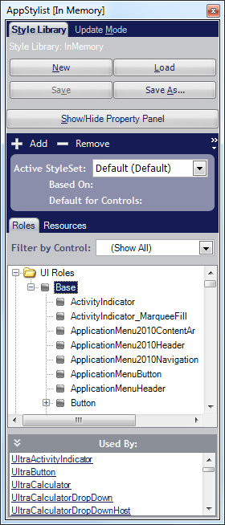

////

|metadata|
{
    "name": "appstylistruntime-about-appstylistruntime",
    "controlName": [],
    "tags": [],
    "guid": "{AECC1DE9-B08F-49E4-A186-E1355461CB4E}",  
    "buildFlags": [],
    "createdOn": "0001-01-01T00:00:00Z"
}
|metadata|
////

= About AppStylistRuntime

The AppStylistRuntime™ component allows you to run a more compact version of AppStylist® tied directly into your application. Run the ShowRuntimeApplicationStyler method and the run-time version of AppStylist will appear. Use this component to make UI changes on the fly.

