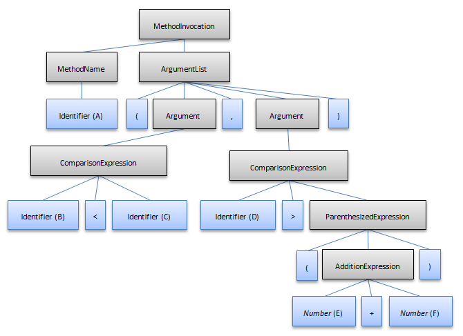
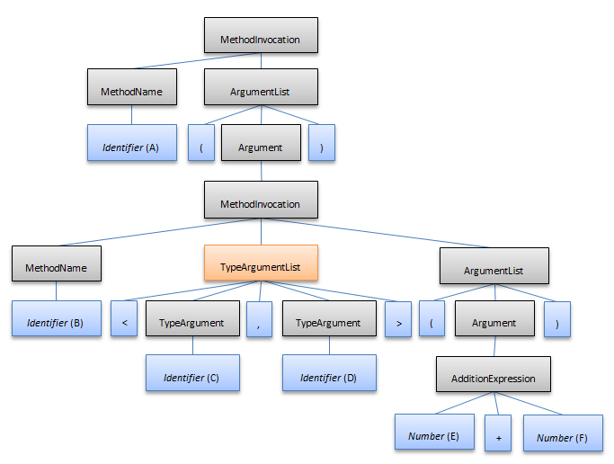

////

|metadata|
{
    "name": "ig-spe-ambiguities",
    "controlName": [],
    "tags": [],
    "guid": "ce30e0f5-86fd-483e-b200-a34a21bf694b",  
    "buildFlags": [],
    "createdOn": "2013-06-13T18:57:35.0348484Z"
}
|metadata|
////

= Ambiguities

== Topic Overview

=== Purpose

This topic describes the ambiguities that may occur while a document is parsing and how to handle them.

=== Required background

The following topics are prerequisites to understanding this topic:

[options="header", cols="a,a"]
|====
|Topic|Purpose

| link:ig-spe-syntax-parsing-engine-overview.html[Syntax Parsing Engine Overview]
|This topic provides an overview of the Syntax Parsing Engine.

| link:ig-spe-grammar-overview.html[Grammar Overview]
|This topic provides an overview of the Syntax Parsing Engine’s Grammar.

| link:ig-spe-grammar-analysis.html[Grammar Analysis]
|This topic explains the grammar analysis performed by the Syntax Parsing Engine.

|====

=== In this topic

This topic contains the following sections:

* <<_Ref349309785, Introduction >>
* <<_Ref349309790, Ambiguity summary >>
* <<_Ref349309794, Local ambiguities >>
* <<_Ref349309797, Global ambiguities >>
* <<_Ref349309800, Related Content >>

[[_Ref349309785]]
== Introduction

[[_Ref349309790]]

=== Ambiguity summary

The Syntax Parsing Engine is a bottom-up parser, which refers to the direction in which the syntax tree is created during syntax analysis. It starts by creating nodes for the tokens from the lexer as it processes them from left to right and then it groups together various branches of the tree and gives them parent nodes representing non-terminal symbols. This continues until a group of branches is given a parent node representing the start symbol of the grammar. Each “grouping of branches” involves finding all nodes representing symbols from the body of a production in the order in which they are defined in the body and giving them a parent node associated with the head non-terminal symbol from the production. This operation is called a  _reduction_  , because the parser is reducing the body of a production to its head symbol. This process is very fast as long as the parser only has one thing to do - either read the next token or perform a reduction. But when there are multiple things the parser could possibly do, this causes an ambiguity.

The Syntax Parsing Engine is able to handle ambiguities, however handling them may cause performance to suffer. Keeping ambiguities in a grammar definition to a minimum will ensure that the syntax analyzer will work as fast as possible.

There are two types of ambiguities:

* <<_Ref349309794,Local ambiguities>>
* <<_Ref349309797,Global ambiguities>>

[[_Ref349309794]]

=== Local ambiguities

A local ambiguity is one from which the parser will eventually recover after reading enough text.

For example, if the parser is reading a C# document, and it comes to a statement which begins with

*In C#:*

[source,csharp]
----
var a = X<Y
----

the parser doesn’t know if

* “X” is a generic type name and “Y” is one of the generic type parameters, for example:

*In C#:*

[source,csharp]
----
var a = X<Y>.CreateNew();
----

* Or “X” and “Y” are variables or properties and they are being compared with the less than sign, for example:

*In C#:*

[source,csharp]
----
var a = X<Y;
----

But whatever the case, the parser will figure it out once it keeps reading past the “Y”. So the ambiguity is only temporary and the parser eventually recovers from it.

[[_Ref349309797]]

=== Global ambiguities

In a global ambiguity the same text can be interpreted two or more different ways. In some languages this is valid as long as the grammar writer tells the parser which interpretation should be used.

Example of an ambiguous C# statement:

*In C#:*

[source,csharp]
----
A(B<C,D>(E+F));
----

It is obvious that a method named “A” is being invoked, but what is being passed to the method is ambiguous. It could either be two Boolean arguments (“B<C” and “D>(E+F)”) or it could be one argument which is the return value of a generic method call (“B<C,D>(E+F)”).

To resolve this issue you can use the link:{ApiPlatform}documents.textdocument{ApiVersion}~infragistics.documents.parsing.nonterminalsymbol~haspriority.html[NonTerminalSymbol.HasPriority] property. If a sub-tree for one of the interpretations of the content has a symbol with this property set, that interpretation will be chosen over the other. If both sub-trees have priority the one which contains a priority non-terminal symbol node higher in the sub-tree will get priority. In the above example the grammar writer may want to specify that if anything can be interpreted as a generic method call, it must be interpreted as a generic method call. Setting the `HasPriority` property to `True` on the symbol representing generic type arguments will remove the ambiguity.

The following two diagrams show how the two sub-trees would look when the parser has read the full content of this statement.

The two argument interpretation:

The one argument interpretation which has a priority node in the sub-tree:

.Note
[NOTE]
====
The "TypeArgumentList" non-terminal node is marked as having priority. Since it has the highest (and only) priority node of the two trees, the 2nd tree is used and the 1st is discarded by the parser.
====

The other way to resolve a global ambiguity is by overriding the  _OnGlobalAmbiguityDetected_   method on a link:{ApiPlatform}documents.textdocument{ApiVersion}~infragistics.documents.parsing.languagebase.html[LanguageBase] derived class or by handling the link:{ApiPlatform}documents.textdocument{ApiVersion}~infragistics.documents.parsing.customlanguage~globalambiguitydetected_ev.html[GlobalAmbiguityDetected] event on the link:{ApiPlatform}documents.textdocument{ApiVersion}~infragistics.documents.parsing.customlanguage.html[CustomLanguage] class. These are invoked with two possible sub-trees which can represent the same content of the document and allow the developer to choose which one should be used. If there are more than two possible interpretations, these members will be invoked multiple times until only one sub-tree remains.

If a global ambiguity is not resolved, meaning the global ambiguity method/event was not handled or the link:{ApiPlatform}documents.textdocument{ApiVersion}~infragistics.documents.parsing.globalambiguitycontext~preferredsubtreeroot.html[PreferredSubTreeRoot] value of the context object was not set, the parser will arbitrarily pick one of the sub-trees to use.

[[_Ref349309800]]
== Related Content

=== Topics

The following topics provide additional information related to this topic.

[options="header", cols="a,a"]
|====
|Topic|Purpose

| link:ig-spe-lexical-analysis.html[Lexical Analysis]
|The topics in this group explain the lexical analysis performed by the Syntax Parsing Engine.

| link:ig-spe-syntax-analysis-overview.html[Syntax Analysis Overview]
|This topic explains the syntax analysis performed by the Syntax Parsing Engine.

| link:ig-spe-restrictions.html[Restrictions]
|This topic explains the restrictions placed on grammar definitions.

|====