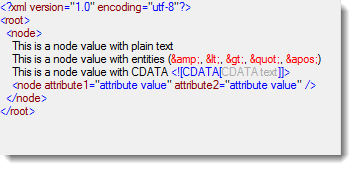

////

|metadata|
{
    "name": "ig-spe-implementing-a-textdocument-with-a-richtextbox",
    "controlName": [],
    "tags": [],
    "guid": "53557c82-76cf-46a1-860f-eda2f6a56b2a",  
    "buildFlags": [],
    "createdOn": "2013-06-13T18:57:35.1268576Z"
}
|metadata|
////

= Implementing a TextDocument with a RichTextBox

== Topic Overview

=== Purpose

This topic provides a conceptual overview, with code, on how to use the TextDocument class to parse syntax with a RichTextBox control.

=== In this topic

This topic contains the following sections:

* <<_Ref324841248,Introduction>>

** <<_Ref327859845,Implementing TextDocument with a RichTextBox summary>>

* <<_Ref327861013,Step 1: Create a Grammar Object – Code Example>>

** <<_Ref326147531,Description>>
** <<_Ref326147537,Code>>

* <<_Ref335122245,Step 2: Generate a Custom Language Class – Code Example>>

** <<_Ref335122253,Description>>
** <<_Ref335122256,Code>>

* <<_Ref335122264,Step 3: Parse a Document with the TextDocument – Code Example>>

** <<_Ref335122271,Description>>
** <<_Ref335122276,Code>>

* <<_Ref335122283,Step 4: Display the Parsed Text in a RichTextBox – Code Example>>

** <<_Ref335122290,Description>>
** <<_Ref335122296,Image>>
** <<_Ref335122301,Code>>

* <<_Ref335122305,Related Content>>

** <<_Ref335122311,Topics>>

[[_Introduction]]
[[_Ref324841248]]
== Introduction

[[_Implementing_TextDocument_with]]

=== Implementing TextDocument with a RichTextBox summary

Used “behind the scenes” the `TextDocument` class can highlight text in a RichTextBox control according to the grammar of a custom-defined language. This allows users to see the structure of a document with keywords distinctly highlighted in the text. The following sections outline the essential steps required to implement this functionality.

.Note:
[NOTE]
====
To use the `TextDocument`, your project must have a reference to one of the following Infragistics files:

Infragistics4.Documents.TextDocument.v{ProductVersion}.dllor

Infragistics.Documents.TextDocument.dll.
====

[[_Ref324842387]]

[[_Ref324841253]]

[[_Step_1:_Create]]
[[_Ref327861013]]
== Step 1: Create a Grammar Object – Code Example

[[_Description_3]]

=== Description

Create a new Grammar object for the custom language by calling the `FromEbnf()` method and passing the string contents of the Extended Backus–Naur Form (EBNF) script, and a new instance of an `EbnfParser`. This step requires an EBNF script; a text-based script that defines the grammar, lexer states, terminal symbols, and other attributes of a custom-defined language.

This step creates a Grammar object from the EBNF. Used in a subsequent step, the Grammar object generates a C# class that will be used by the `TextDocument`.

The following code example shows this step with reference to an EBNF script that defines the grammar for XML:

[[_Code_3]]

=== Code

*In C#:*

[source,csharp]
----
//  Get the EBNF script from a resource “EBNF.XML.ebnf” and assign to a string
string ebnf = GetEbnf("EBNF.XML.ebnf");
//  Create a Grammar instance from the EBNF script, using an EbnfParser.
Grammar grammar = new Grammar();
EbnfParser ebnfParser = new EbnfParser();
//  Create the Grammar and capture the results of the operation to 
//  confirm its successful completion. 
EbnfParseResult result = grammar.FromEbnf(ebnf, ebnfParser);
----

[[_Step_2:_Generate]]
[[_Ref335122245]]
== Step 2: Generate a Custom Language Class – Code Example

[[_Description]]

=== Description

Call the static `LanguageGenerator` class’ `GenerateClass()` method to create a custom language class and pass in the Grammar object created previously in step 1.

The following code example creates a  _XMLLanguage.cs_   code file to provide an API for the language called “XML Language”. The newly created file,  _XMLLanguage.cs_   can be compiled in applications containing RichTextBoxes capable of displaying an XML document with highlighted tokens (see subsequent steps below).

[[_Code]]

=== Code

*In C#:*

[source,csharp]
----
//  Generate the code for a LanguageBase-derived class from the grammar.
//  This will create the data required for our internal lexer and parser.
LanguageGenerationParams args = new LanguageGenerationParams(grammar, "XMLLanguage", "XMLLanguage.cs", true);
LanguageGenerator.GenerateClass(args);
----

[[_Step_3:_Parse]]
[[_Ref335122264]]
== Step 3: Parse a Document with the TextDocument – Code Example

[[_Description_1]]

=== Description

Use the `TextDocument` object to parse a document in memory.

The following code example shows a `TextDocument` being instantiated using the custom language class created in Step 2 above ( _XMLLanguage.cs_ ) and parsing the XML text from a TextBox control. At this point, the `TextDocumentSnapshot` object in memory stores the parsed document; however, the UI does not yet display it.

[[_Code_1]]

=== Code

*In C#:*

[source,csharp]
----
//  Create the TextDocument with an instance of the XMLLanguage that was previously 
//  generated by the LanguageGenerator
private TextDocument _textDocument;
_textDocument = new TextDocument();
_textDocument.Language = XMLLanguage.Instance;
//  Delete any text that may be in the current TextDocumentSnapshot.
//  Append the text from a TextBox on the form.
//  Parse the text according to the grammar rules in the XMLLanguage instance.
_textDocument.Delete();
_textDocument.Append(textBox.Text);
_textDocument.Parse();
----

[[_Step_4:_Display]]
[[_Ref335122283]]
== Step 4: Display the Parsed Text in a RichTextBox – Code Example

[[_Description_2]]

=== Description

You can display the parsed text in a RichTextBox with the various tokens highlighted according to the custom language. The RichTextBox should appear similar to the one pictured below:

[[_Image]]

=== Image

[[_Code_2]]

=== Code

*In C#:*

[source,csharp]
----
//  Get the snapshot from which the tree was created
TextDocumentSnapshot snapshot = _textDocument.SyntaxTree.Snapshot;
//  Get a token enumerator which includes all tokens
IEnumerable<Token> tokens = snapshot.GetTokens();
//  Enumerate the tokens and populate the rich textbox
RichTextBox rtb = richTextBox1;
rtb.Text = snapshot.GetText();
int breakOffsets = 0;
foreach (Token token in tokens)
{
    string tokenText = token.Text;
    if (tokenText.Length == 0)
        continue;
    if (tokenText.Equals("\r\n"))
    {
        breakOffsets++;
        continue;
    }
    rtb.Select(token.OverallOffset - breakOffsets, tokenText.Length);
    //  Set the color for the token based on what we defined
    //  in the language.
    Color color = XMLLanguage.GetColor(token.TerminalSymbol);
    rtb.SelectionColor = color;
}
----

[[_Related_Content]]
[[_Ref335122305]]
== Related Content

[[_Topics]]

=== Topics

The following topic provides additional information related to this topic.

[options="header", cols="a,a"]
|====
|Topic|Purpose

| link:ig-spe-methods-for-modifying-text-in-a-textdocument.html[Methods for Modifying Text in a TextDocument]
|This topic uses descriptive text and code snippets to illustrate the `TextDocument` class methods for text modification.

| link:ig-spe-events-for-interacting-with-a-textdocument.html[Events for Interacting with a TextDocument]
|This topic uses descriptive text and code snippets to illustrate the `TextDocument` class events.

| link:ig-spe-properties-for-configuring-a-textdocument.html[Properties for Configuring a TextDocument]
|This topic uses descriptive text and code snippets to illustrate the `TextDocument` class properties that allow for configuration and provide information about the class.

|====