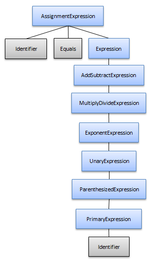
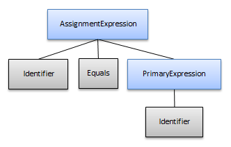

////

|metadata|
{
    "name": "ig-spe-pruning-the-syntax-tree",
    "controlName": [],
    "tags": [],
    "guid": "bb4ed469-abdb-49e5-8300-77fd62f6e670",  
    "buildFlags": [],
    "createdOn": "2013-06-13T18:57:35.1358585Z"
}
|metadata|
////

= Pruning the Syntax Tree

== Topic Overview

=== Purpose

This topic explains the syntax tree pruning types performed by the Syntax Parsing Engine.

=== Required background

The following topics are prerequisites to understanding this topic:

[options="header", cols="a,a"]
|====
|Topic|Purpose

| link:ig-spe-syntax-parsing-engine-overview.html[Syntax Parsing Engine Overview]
|This topic provides an overview of the Syntax Parsing Engine.

| link:ig-spe-grammar-overview.html[Grammar Overview]
|This topic provides an overview of the Syntax Parsing Engine’s Grammar.

| link:ig-spe-syntax-tree-overview.html[Syntax Tree Overview]
|This topic explains when the syntax tree is created and how to access it.

|====

=== In this topic

This topic contains the following sections:

* <<_Ref350263733, Pruning Overview >>
* <<_Ref350263595, Pruning Based on Name >>
* <<_Ref350260807, Pruning Based on Children >>
* <<_Ref350260820, Related Content >>

[[_Ref350263733]]
== Pruning Overview

=== Pruning summary

It may be necessary for organizational purposes, error handling behavior, ambiguity resolution, or other reasons for the grammar writer to include extra non-terminal symbols in the grammar definition that shouldn’t be included as nodes in the final syntax tree. There are two types of pruning which can be used to exclude these symbols from the syntax tree:

* <<_Ref350263595,Pruning Based on Name>>
* <<_Ref350260807,Pruning Based on Children>>

To change the types of syntax tree pruning use the link:{ApiPlatform}documents.textdocument{ApiVersion}~infragistics.documents.parsing.grammar~syntaxtreepruningmode.html[Grammar.SyntaxTreePruningMode] property and set it to a value of type link:{ApiPlatform}documents.textdocument{ApiVersion}~infragistics.documents.parsing.syntaxtreepruningmode.html[SyntaxTreePruningMode]. By default, both pruning modes are enabled.

[[_Ref350263595]]
== Pruning Based on Name

=== Pruning based on name summary

In many cases, it makes sense to include certain “helper” non-terminal symbols in the grammar definition which can decrease grammar complexity or prevent common patterns from being repeated in an EBNF file. Most of the time, these non-terminals symbols should not have associated nodes in the syntax tree, so they can be excluded by naming them with an underscore as the first character, as in the following example:

FieldDeclaration =

_typeMemberPrefix, Semicolon;

MethodDeclaration =

_typeMemberPrefix, ParameterList, MethodBody;

PropertyDeclaration =

_typeMemberPrefix, PropertyBody;

_typeMemberPrefix =

[Attributes], [Modifiers], Type, Identifier;

When the syntax tree is pruned based on name, all non-terminal symbols which start with an underscore will never appear as nodes in the tree and their child nodes will be promoted up to be children of the next included parent node in the tree.

[[_Ref350260807]]
== Pruning Based on Children

[[_Ref350260817]]

=== Pruning based on children summary

A common way of preventing global ambiguities when defining operator rules is to arrange the rules in such a way so that lower precedence operations “own” higher precedence operations, thereby allowing the higher precedence operations to be grouped together with their operands. A side effect of this arrangement is that the more common simple expressions, such as an identifier referenced by itself, could lead to a very dense syntax tree where the identifier node is owned by nodes representing each lower precedence level.

For example a simple assignment expression like “x = y” may lead to a syntax tree structure like this:

However, with the “based on children” pruning, the syntax tree will look like this instead:

This pruning mode removes any non-terminal symbol node which owns a single non-terminal symbol node. The child non-terminal symbol node is then promoted to be a child of the next included ancestor node.

[[_Ref350260820]]
== Related Content

=== Topics

The following topics provide additional information related to this topic.

[options="header", cols="a,a"]
|====
|Topic|Purpose

| link:ig-spe-ignored-content.html[Ignored Content]
|This topic explains how to access the ignored content produced during syntax analysis.

| link:ig-spe-custom-diagnostics-and-annotations.html[Custom Diagnostics and Annotations]
|This topic explains how to attach and obtain additional data to and from the syntax tree.

|====