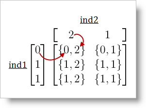

////

|metadata|
{
    "name": "infragistics-math-working-with-matrices",
    "controlName": ["Infragistics Math Library"],
    "tags": ["Application Blocks","Calculations"],
    "guid": "fb28f3df-2599-4fbd-b5fc-f40468838f13",  
    "buildFlags": [],
    "createdOn": "2011-08-01T14:12:46.9889024Z"
}
|metadata|
////

= Working With Matrices

This topic demonstrates the operations you can perform with Matrices. It covers link:{ApiPlatform}math{ApiVersion}~infragistics.math.matrix.html[Matrix] instances only, but the information in it applies to all matrix types – link:{ApiPlatform}math{ApiVersion}~infragistics.math.matrix.html[Matrix], link:{ApiPlatform}math{ApiVersion}~infragistics.math.booleanmatrix.html[BooleanMatrix], and link:{ApiPlatform}math{ApiVersion}~infragistics.math.complexmatrix.html[ComplexMatrix].

== Types of Matrix Operations

The operations supported by matrices fall into the following basic categories:

* <<Indexing,Indexing>>
* <<Arithmetical,Arithmetical Operations (+, -, $$*$$, /, %) – *Matrix* and *ComplexMatrix* only>>
* <<Logical,Logical Operations (!, &, | ) – *BooleanMatrix* only>>
* <<Comparison,Comparison Operations (<, $$<=$$, >, >=, ==, !=)>>

Each of them is explained in an individual section.

[[Indexing]]
== Indexing

Indexing retrieves the element at a particular position in the matrix.

== Indexing as Array (Default)

In the Infragistics Math Library, matrices can be indexed as arrays:

*In Visual Basic:*

----
Dim x As New Matrix(New Double() {1, 2, 3, 4}, New Integer() {2, 2})
Dim e0 As Double = x(0)
' 1
Dim e3 As Double = x(3)
' 4
----

*In C#:*

----
Matrix x = new Matrix(new double[] { 1, 2, 3, 4 }, new int[] { 2, 2 });
double e0 = x[0]; // 1
double e3 = x[3]; // 4
----

== Indexing With a Vector

Matrices can be indexed one-dimensionally with a vector of indices. This results in a one-dimensional row matrix containing the elements from the initial matrix which were at the positions defined by the vector:

*In Visual Basic:*

----
'x
' 1 4 7
' 2 5 8
' 3 6 9
Dim dimensions As Integer() = New Integer() {3, 3}
Dim elements As Double() = New Double() {1, 2, 3, 4, 5, 6, 7, 8, 9}
Dim x As New Matrix(elements, dimensions)
Dim ind As Vector = New Double() {0, 3, 8}
Dim y As Matrix = x(ind)
' x[0]=1, x[3]=4, x[8]=9
' y={  1,      4,      9 }
----

*In C#:*

----
//x
// 1 4 7
// 2 5 8
// 3 6 9
int[] dimensions = new int[] { 3, 3 };
double[] elements = new double[] { 1, 2, 3, 4, 5, 6, 7, 8, 9 };
Matrix x = new Matrix(elements, dimensions);
Vector ind = new double[] { 0, 3, 8 };
Matrix y = x[ind];
// x[0]=1, x[3]=4, x[8]=9
// y={  1,      4,      9 }
----

== Multi-Dimensional Indexing

In multi-dimensional indexing, elements are retrieved as per their coordinates in the matrix (In a two-dimensional matrix, the coordinates would be the row number and the column number):

*In Visual Basic:*

----
Dim x As New Matrix(New Double() {1, 2, 3, 4}, New Integer() {2, 2})
Dim c0 As Double = x(0, 0)
' 1
Dim c3 As Double = x(1, 1)
' 4
----

*In C#:*

----
Matrix x = new Matrix(new double[] { 1, 2, 3, 4 }, new int[] { 2, 2 });
double c0 = x[0,0]; // 1
double c3 = x[1,1]; // 4
----

== Multi-Dimensional Indexing with Vectors

In multi-dimensional indexing with Vectors, elements are retrieved as per their coordinates and the coordinates are created by two vectors.

For example, let’s have two vectors:

_ind1 = { 0, 1, 1 }_

_ind2 = { 2, 1 }_

Let these vectors form a new matrix containing pairs of indices (Figure 1):

Figure 1: Matrix with pairs of indices.

After multi-dimensional indexing of the target matrix with vectors, a new matrix will be formed – it will have the dimensions of the matrix from Figure 1, and its elements are going to be the ones from the target matrix with positions {0, 2}, {1, 2}, … .

The code below creates a matrix and two vectors and uses the vectors to retrieve elements from the matrix in a multi-dimensional manner:

*In Visual Basic:*

----
'x
' 1 4 7
' 2 5 8
' 3 6 9
Dim dimensions As Integer() = New Integer() {3, 3}
Dim elements As Double() = New Double() {1, 2, 3, 4, 5, 6, 7, 8, 9}
Dim x As New Matrix(elements, dimensions)
Dim ind1 As Vector = New Double() {0, 1, 1}
Dim ind2 As Vector = New Double() {2, 1}
'The two vectors will form an indexing matrix:
' 0,2 0,1
' 1,2 1,1
' 1,2 1,1
Dim y As Matrix = x(ind1, ind2)
'Initial     Matrix with   Result
'matrix       indices
' 1 4 7       0,2 0,1       7 4
' 2 5 8       1,2 1,1       8 5
' 3 6 9       1,2 1,1       8 5
----

*In C#:*

----
//x
// 1 4 7
// 2 5 8
// 3 6 9
int[] dimensions = new int[] { 3, 3 };
double[] elements = new double[] { 1, 2, 3, 4, 5, 6, 7, 8, 9 };
Matrix x = new Matrix(elements, dimensions);
Vector ind1 = new double[] { 0, 1, 1 };
Vector ind2 = new double[] { 2, 1 };
//The two vectors will form an indexing matrix:
// 0,2 0,1
// 1,2 1,1
// 1,2 1,1
Matrix y = x[ind1, ind2];
//Initial     Matrix with   Result
//matrix       indices
// 1 4 7       0,2 0,1       7 4
// 2 5 8       1,2 1,1       8 5
// 3 6 9       1,2 1,1       8 5
----

[[Arithmetical]]
== Arithmetical Operations

Arithmetical operations are supported by Matrix and ComplexMatrix types only.

== Supported Operations

Infragistics Math Library’s matrices support the following arithmetical operations:

* addition (+)
* subtraction (-)
* multiplication ($$* $$)
* division (/)
* division with remainder (%)

The arithmetical operations are performed on the counterpart elements of the matrices.

The link:{ApiPlatform}math{ApiVersion}~infragistics.math.matrix.html[Matrix] class also supports arithmetical operations between a matrix and a complex number.

== Requirements

Matrices must have the same dimensions.

== Code Examples

=== Adding a Matrix and a Number

The code below adds a double to a matrix:

*In Visual Basic:*

----
'x
' 1 3
' 2 4
Dim x As New Matrix(New Double(,) {{1, 2}, {3, 4}})
'y
' (1+2) (3+2)
' (2+2) (4+2)
Dim y As Matrix = x + 2
----

*In C#:*

----
//x
// 1 3
// 2 4
Matrix x = new Matrix(new double[,] { { 1, 2 }, { 3, 4 } });
//y
// (1+2) (3+2)
// (2+2) (4+2)
Matrix y = x + 2;
----

=== Multiplying Two Matrices

Multiplication of matrices in the Infragistics Math Library consists of multiplying the counterpart elements in matrices with the same dimensions using the $$*$$ operator. This operation is different from true matrix multiplication as defined in mathematics.

*Note:*

If you want true matrix multiplication, use the link:{ApiPlatform}math{ApiVersion}~infragistics.math.compute~matrixproduct.html[Compute.MatrixProduct] method instead of the multiplication shown here.

The example below multiplies two matrices using the $$*$$ operator.

*In Visual Basic:*

----
'x
' 1 3
' 2 4
Dim x As New Matrix(New Double(,) {{1, 2}, {3, 4}})
'y
' 1 2
' 1 2
Dim y As New Matrix(New Double(,) {{1, 1}, {2, 2}})
'z
' (1*1) (3* 2)
' (2*1) (4* 2)
Dim z As Matrix = x * y
----

*In C#:*

----
//x
// 1 3
// 2 4
Matrix x = new Matrix(new double[,] { { 1, 2 }, { 3, 4 } });
//y
// 1 2
// 1 2
Matrix y = new Matrix(new double[,] { { 1, 1 }, { 2, 2 } });
//z
// (1*1) (3* 2)
// (2*1) (4* 2)
Matrix z = x * y;
----

[[Logical]]
== Logical Operations

Logical operations are supported by BooleanMatrix only. They can be performed:

* between matrices
* between a Boolean matrix and Boolean variable

When performed between matrices:

* logical AND and OR are executed on the counterpart elements
* logical NOT is executed on each element

When performed between a Boolean matrix and Boolean variable, the operation is performed on each element of the matrix and the variable.

Logical operations return a new Boolean matrix.

== Supported Operations

* AND (&)
* OR (|)
* NOT (!)

== Requirements

Matrices must have the same dimensions.

== Code Example

The following example creates two BooleanMatrix instances and demonstrates how to use them in the logical operations NOT, AND, and OR:

*In Visual Basic:*

----
'x
' true false
' true false
Dim x As New BooleanMatrix(New Boolean(,) {{True, True}, {False, False}})
'y
' true true
' false false
Dim y As New BooleanMatrix(New Boolean(,) {{True, False}, {True, False}})
'NOT
' false true
' false true 
Dim NOT_x As BooleanMatrix = Not x
'AND
' true false
' false false
Dim x_AND_y As BooleanMatrix = x And y
'OR
' true true
' true false
Dim x_OR_y As BooleanMatrix = x Or y
----

*In C#:*

----
//x
// true false
// true false
BooleanMatrix x = new BooleanMatrix(new bool[,] { { true, true }, { false, false } });
//y
// true true
// false false
BooleanMatrix y = new BooleanMatrix(new bool[,] { { true, false }, { true, false } });
//NOT
// false true
// false true
BooleanMatrix NOT_x = !x;
//AND
// true false
// false false
BooleanMatrix x_AND_y = x & y;
//OR
// true true
// true false
BooleanMatrix x_OR_y = x | y;
----

[[Comparison]]
== Comparison Operations

== Supported Operations

Infragistics Math Library’s matrices support the following operations for comparison:

* equal to (==)
* not equal to (!=)
* greater than (>)
* less than (<)
* greater than or equal to (>=)
* less than or equal to ($$<=$$)

These operations are performed on counterpart elements of the matrices.

The == and != operators compare the elements and the dimensions of the matrices and return a Boolean value.

The <, $$<=$$, >, and >= operators compare the corresponding values in the matrices. These operators return a link:{ApiPlatform}math{ApiVersion}~infragistics.math.booleanmatrix.html[BooleanMatrix] instance and are defined only for link:{ApiPlatform}math{ApiVersion}~infragistics.math.matrix.html[Matrix] and link:{ApiPlatform}math{ApiVersion}~infragistics.math.complexmatrix.html[ComplexMatrix]. Each element of the returned Boolean matrix will be the result of the comparison of the corresponding elements from the initial matrices.

link:{ApiPlatform}math{ApiVersion}~infragistics.math.matrix.html[Matrix] and link:{ApiPlatform}math{ApiVersion}~infragistics.math.complexmatrix.html[ComplexMatrix] can be compared to each other and to *double* and link:{ApiPlatform}math{ApiVersion}~infragistics.math.complex.html[Complex]. link:{ApiPlatform}math{ApiVersion}~infragistics.math.booleanmatrix.html[BooleanMatrix] can be compared also to a Boolean value.

== Requirements

Matrices must have the same dimensions.

== Related Topics

link:infragistics-math-creating-matrices.html[Creating Matrices]

link:infragistics-math-complex-numbers.html[Complex Numbers]

link:infragistics-math-vectors.html[Vectors]

link:infragistics-math-mathematical-functions.html[Mathematical Functions]

link:infragistics-math-api-overview.html[API Overview]