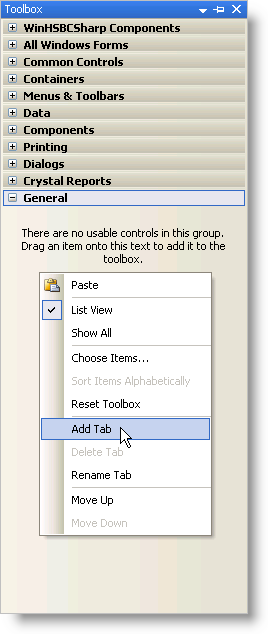

////

|metadata|
{
    "name": "introduction-dragging-assemblies-from-the-bin-folder",
    "controlName": [],
    "tags": ["Getting Started"],
    "guid": "{D8CCA4F9-AC7E-4B9B-A394-5BE4BDFD0072}",  
    "buildFlags": [],
    "createdOn": "0001-01-01T00:00:00Z"
}
|metadata|
////

= Dragging Assemblies from the Bin Folder

As an alternative to link:introduction-running-the-toolbox-utility.html[Running the Toolbox Utility] to add Infragistics Professional controls/components to the Visual Studio .NET toolbox, you can drag Infragistics' assemblies from your Bin folder to the Microsoft® Visual Studio® toolbox.

*To drag Infragistics' assemblies from your Bin folder to the Visual Studio toolbox:*

[start=1]
. In the Visual Studio IDE, make sure that the toolbox is visible by selecting Toolbox on the View menu.
[start=2]
. Right-click anywhere on the toolbox and select Add Tab.

[start=3]
. Give the tab a meaningful name such as "Infragistics Windows Forms". You may also want to add the volume number (e.g., 8.1, 7.3, 7.2, 7.1) as a suffix.

image::Images/Introduction_Drag_and_Drop_Assemblies_from_the_Bin_Folder_03.png[Visual Studio toolbox with newly added tab.]

[start=4]
. Repeat steps 2 and 3 for all the tabs you want to create.
[start=5]
. In Windows Explorer, navigate to the Bin directory where the Infragistics Professional assemblies are installed. The assemblies contain the DLLs that you want to add:

** Windows Forms -- {InstallPath}\Bin

[start=6]
. Select the DLLs that contain the Infragistics Professional controls/components you want to add to the Visual Studio toolbox.

image::Images/Introduction_Drag_and_Drop_Assemblies_from_the_Bin_Folder_04.png[Location of assemblies highlighted to be dragged over to the toolbox.]
[start=7]
. Drag the DLLs over to the Visual Studio tab you created in steps 2 to 4.

*Note:* If you add all the tools to the toolbox at the same time, it may take a few seconds for Visual Studio to add them all.

== Related Topics

link:introduction-running-the-toolbox-utility.html[Running the Toolbox Utility]

link:introduction-using-the-choose-toolbox-items-dialog-box.html[Using the Choose Toolbox Items Dialog Box]