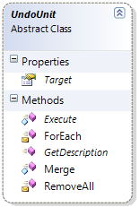

////

|metadata|
{
    "name": "methods-and-properties-reference-for-creating-custom-undounit",
    "controlName": [],
    "tags": ["API","Application Scenarios","Tips and Tricks"],
    "guid": "e1eabd96-cad2-418f-be8a-21682f5298e3",  
    "buildFlags": [],
    "createdOn": "2012-09-06T12:08:35.3900125Z"
}
|metadata|
////

= Methods and Properties Reference for Creating Custom UndoUnit

== Topic Overview

=== Purpose

This topic lists the available methods and properties related to creating of a custom UndoUnit in the Infragistics Undo/Redo Framework™.

=== Required background

The following table lists the topics required as a prerequisite to understanding this topic.

[options="header", cols="a,a"]
|====
|Topic|Purpose

| link:undounit-derived-classes-properties-and-methods-reference.html[UndoUnit Derived Classes, Properties and Methods Reference]
|This topic lists the derived classes and some of the important properties and methods of the UndoUnit class.

|====

=== In this topic

This topic contains the following sections:

* <<_Ref321150202, Methods and Properties Reference for Creating Custom UndoUnit >>
** <<_Ref321150208,Introduction>>
** <<_Ref321150221,Methods reference summary>>
** <<_Ref321150226,Properties reference summary>>

* <<_Ref321150232, Related Content >>

[[_Ref321150202]]
== Methods and Properties Reference for Creating Custom UndoUnit

[[_Ref321150208]]

=== Introduction

The link:{ApiPlatform}undo{ApiVersion}~infragistics.undo.undounit_members.html[UndoUnit] is an abstract base class that is used to undo/redo changes.

If you need to support undo/redo of specific type of changes, you need to create a custom `UndoUnit`. The class exposes several abstract members listed below.

[[_Ref321150221]]

=== Methods reference summary

The following table summarizes the purpose and functionality of the methods exposed by the `UndoUnit` class.

[options="header", cols="a,a"]
|====
|Method|Description

|`Execute`
|Used to perform the undo/redo operation for the change. 

The method takes link:{ApiPlatform}undo{ApiVersion}~infragistics.undo.undoexecutecontext_members.html[UndoExecuteContext] object as a parameter. This parameter provides information about: 

* the type of operation being performed (for example - Undo, Redo, Rollback) 

* The reference to the `UndoManager` for which the operation is being performed. 

.Note: 

[NOTE] 

==== 

During an Undo/Redo operation, the object will be removed from the Undo/Redo stack and will not automatically be put onto the alternate stack. 

It is assumed that the changes made by the UndoUnit will result in operations being added to the undo/redo stack by invoking the AddChange method (directly or indirectly via helper methods). 

If the object being manipulated is not responsible for doing this, the custom UndoUnit could handle this itself. 

====

| link:{ApiPlatform}undo{ApiVersion}~infragistics.undo.undounit~getdescription.html[GetDescription]
|Returns a string description of the type of change. 

The method takes two parameters: 

* an link:{ApiPlatform}undo{ApiVersion}~infragistics.undo.undohistoryitemtype.html[UndoHistoryItemType] – to indicate from which history a description is required 

* a boolean value to specify if a detailed description is needed. 

|`Merge`
|Used to provide custom support for merging `UndoUnits`.

|====

[[_Ref321150226]]

=== Properties reference summary

The following table summarizes the purpose and functionality of the properties exposed by the `UndoUnit` class.

[options="header", cols="a,a"]
|====
|Property|Description

| link:{ApiPlatform}undo{ApiVersion}~infragistics.undo.undounit~target.html[Target]
|Identifies the object that will be affected by the `UndoUnit`. 

This is a read-only property used mainly for informational purposes when the methods `ForEach` or `RemoveAll` are used.

|====

[[_Ref321150232]]
== Related Content

=== Topics

The following topics provide additional information related to this topic.

[options="header", cols="a,a"]
|====
|Topic|Purpose

| link:methods-reference-for-adding-undounits-to-the-undo-history.html[Methods Reference for Adding UndoUnits to the Undo History]
|This topic lists the available methods for adding an UndoUnit derived class object to the undo history.

| link:methods-reference-for-removing-undounits-from-the-history.html[Methods Reference for Removing UndoUnits from the History]
|This topic lists the available methods for removing the UndoUnit instances from the undo/redo history.

| link:methods-reference-for-registering-unregistering-objects.html[Methods Reference for Registering and Unregistering Objects]
|This topic lists the methods that register/unregister a specific object to an UndoManager instance.

| link:methods-reference-for-performing-undo-redo-operations.html[Methods Reference for Performing Undo Redo Operations]
|This topic lists the available methods for performing undo and redo operations.

| link:methods-and-properties-reference-for-performing-transactions.html[Methods and Properties Reference for Performing Transactions]
|This topic lists the available methods and properties for performing undo/redo transactions.

| link:methods-and-properties-reference-for-merging-undoredo-operations.html[Methods and Properties Reference for Merging Undo Redo Operations]
|This topic lists the available methods and properties related to the merging of undo/redo operations.

| link:methods-reference-for-suspending-and-resuming-saving-history.html[Methods Reference for Suspending and Resuming Saving History]
|This topic lists the available methods for suspending and resuming the saving of the undo/redo operations in history.

|====