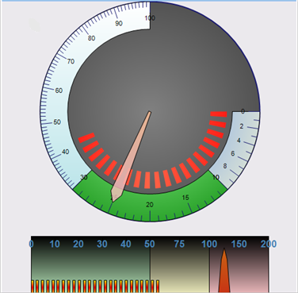

////

|metadata|
{
    "name": "new-wingauge-control",
    "controlName": [],
    "tags": [],
    "guid": "{30595AEE-3474-4011-BD1F-5195FC3E773F}",  
    "buildFlags": [],
    "createdOn": "2006-12-12T14:10:03Z"
}
|metadata|
////

= New WinGauge Control

WinGauge™, a new control that was added in the 2007 Volume 1 release, is a visual component that exemplifies ranges using graphics. It shows values represented by needles, markers, and text.

The WinGauge control is represented by the following three types of gauges:

* link:wingauge-linear-gauges.html[Linear Gauge] -- Represents a range of values arranged rectangularly, horizontally, or vertically. This control usually contains one or more sections that represent a specific range. The Needle or Bar markers then move along the axis to mark one or more values. A horizontally oriented gauge is similar to a fuel gauge; a vertically oriented gauge is similar to a thermometer.

image::images/Gauge_Whats_New_For_WinGauge_01.png[new linear gauge]

* link:wingauge-radial-gauges.html[Radial Gauge] -- Displays data in a circular fashion. Although a Radial Gauge can also be square, the Needle and Bar markers that represent current values, rotate much like the hands of a clock.

image::images/Gauge_Whats_New_For_WinGauge_02.png[new radial gauge]

* link:wingauge-digital-gauges.html[Digital Gauge] -- Represents values similar to a digital watch or alarm clock. Each digit within the value is rendered by arranging various "Sections". A Digital Gauge can provide an odometer-like view to an existing gauge, or can stand alone. Also in WinGauge, alpha and numeric characters are supported in the digital gauge function.

image::images/Gauge_Whats_New_For_WinGauge_03.png[new digital gauge]

Additionally, you can combine types of gauges to create a multi-faceted control that displays more than one style of gauge, as shown below. Essentially, all objects in WinGauge can be fully customized using any of the three types of gauges.

