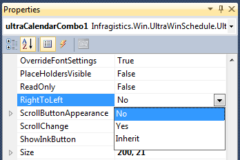

////

|metadata|
{
    "name": "right-to-left-support",
    "controlName": [],
    "tags": [],
    "guid": "d99d7e5f-87a1-4969-a38b-fcf382a5e1f1",  
    "buildFlags": [],
    "createdOn": "2014-01-29T03:57:32.451375Z"
}
|metadata|
////

= Right-to-Left Support

[[_Ref000000001]]

== Topic Overview

=== Purpose

This topic catalogs Infragistics Windows Forms controls that now support Right-to-Left environment.

=== In this topic

This topic contains the following sections:

* <<_Ref378713572,Right-to-Left>>

** <<_Ref377393133,Introduction>>
** <<_Ref377393142,Setting Right to Left mode>>
** <<_Ref377393151,Performance>>

* <<_Ref377393160,Supported Controls>>

** <<_Ref377393167, _WinButton_  >>
** <<_Ref377393174, _WinCalculatorDropDown_  >>
** <<_Ref377393274, _WinCalendarCombo_  >>
** <<_Ref377393281, _WinCheckEditor_  >>
** <<_Ref377393295, _WinColorPicker_  >>
** <<_Ref377393303, _WinCombo_  >>
** <<_Ref377393312, _WinComboEditor_  >>
** <<_Ref377393320, _WinCurrencyEditor_  >>
** <<_Ref377480932, _WinDateTimeEditor_  >>
** <<_Ref377393454, _WinDropDownButton_  >>
** <<_Ref377393463, _WinFontNameEditor_  >>
** <<_Ref377393477, _WinFormattedLinkLabel_  >>
** <<_Ref377393485, _WinFormattedTextEditor_  >>
** <<_Ref377393490, _WinGrid_  >>
** <<_Ref377393496, _WinLabel_  >>
** <<_Ref377480947, _WinMaskedEdit_  >>
** <<_Ref377480955, _WinNumericEditor_  >>
** <<_Ref377393504, _WinOptionSet_  >>
** <<_Ref377393513, _WinProgressBar_  >>
** <<_Ref377393521, _WinScrollBar_  >>
** <<WinTabControl, _WinTabControl_  >>
** <<WinTabStripControl, _WinTabStripControl_  >>
** <<_Ref377393528, _WinTextEditor_  >>
** <<_Ref377393539, _WinTimeSpanEditor_  >>
** <<_Ref377393546, _WinTimeZoneEditor_  >>
** <<_Ref377393554, _WinTrackBar_  >>
** <<_Ref377393565, _WinTree_  >>

[[_Ref378713572]]
== Right-to-Left

[[_Ref377393133]]

=== Introduction

The `Right-to-Left` mode flips the control’s displayed text and UI elements across the line of symmetry, or axis of reflection, rendering a mirrored view of the control’s displayed text and UI elements, which usually displays in a `Left-to-Right` orientation. Some controls support `Right-to-Left` only on the UI elements while others support both, UI elements and the text.

As illustrated with  _WinCalendarCombo_   control below, the position of the text (Not the individual character positions) and the dropdown button are reversed when `RightToLeft=Yes`.

[options="header", cols="a,a"]
|====
|Left-to-Right (Default view)|Right-to-Left

|image::images/Right_to_Left_Support_1.png[]
|image::images/Right_to_Left_Support_2.png[]

|====

The `RightToLeft` property has three options:

[options="header", cols="a,a"]
|====
|Option|Description

|No
|Disables `Right-to-Left` (Default: `Left-to-Right`).

|Yes
|Enables `Right-to-Left`.

|Inherit
|Inherits the `RightToLeft` mode from the parent container, which can be the Form itself or another control. 

If the Form is set with `RightToLeft=Yes`, every control on the form that has `RightToLeft=Inherit` will be overridden by the form’s setting.

|====

[[_Ref376430820]]

=== Setting Right to Left mode

Support for the new `Right-to-Left` mode is now available through the control properties in Visual Studio designer and is fully configurable; alternatively you may do the same in code.

Configuring `Right-to-Left` through property grid.

Configuring `Right-to-Left` in code behind.

*In C#:*

[source,csharp]
----
WinCalendarCombo1.RightToLeft = RightToLeft.Yes;
----

*In Visual Basic:*

[source,vb]
----
WinCalendarCombo1.RightToLeft = RightToLeft.Yes
----

[[_Ref377393151]]

=== Performance

The `Right-to-Left` mode raises performance concerns. Specifically, the implementation of this feature involves modifying the drawing methods at the framework level, and may lead to sacrificing some performance.

<<_Ref000000001,Back to Top>>

[[_Ref377393160]]
== Supported Controls

[[_Ref377393167]]

=== WinButton

Supports `Right-to-Left` on a text caption and other elements such as a displayed icon. By default, the text is centered on the button. In the following example, it was changed to left justify for demonstrating the `Right-to-Left` mode.

[options="header", cols="a,a"]
|====
|Left-to-Right (Default view)|Right-to-Left

|image::images/Right_to_Left_Support_4.png[]
|image::images/Right_to_Left_Support_5.png[]

|====

[[_Ref377393174]]

=== WinCalculatorDropDown

Supports `Right-to-Left` on the edit portion and the dropdown.

[options="header", cols="a,a"]
|====
|Left-to-Right (Default view)|Right-to-Left

|image::images/Right_to_Left_Support_6.png[]
|image::images/Right_to_Left_Support_7.png[]

|====

[[_Ref377393274]]

=== WinCalendarCombo

Supports `Right-to-Left` on the edit portion (Date) and the dropdown button, but not the dropdown content.

[options="header", cols="a,a"]
|====
|Left-to-Right (Default view)|Right-to-Left

|image::images/Right_to_Left_Support_8.png[]
|image::images/Right_to_Left_Support_9.png[]

|====

[[_Ref377393281]]

=== WinCheckEditor

Supports `Right-to-Left` on the text and the checkbox element.

[options="header", cols="a,a"]
|====
|Left-to-Right (Default view)|Right-to-Left

|image::images/Right_to_Left_Support_10.png[]
|image::images/Right_to_Left_Support_11.png[]

|====

[[_Ref377393295]]

=== WinColorPicker

Supports `Right-to-Left` on the edit portion, the dropdown button and the dropdown.

[options="header", cols="a,a"]
|====
|Left-to-Right (Default view)|Right-to-Left

|image::images/Right_to_Left_Support_12.png[]
|image::images/Right_to_Left_Support_13.png[]

|====

[[_Ref377393303]]

=== WinCombo

Supports `Right-to-Left` on the edit portion, the dropdown button, and the dropdown content.

[options="header", cols="a,a"]
|====
|Left-to-Right (Default view)|Right-to-Left

|image::images/Right_to_Left_Support_14.png[]
|image::images/Right_to_Left_Support_15.png[]

|====

[[_Ref377393312]]

=== WinComboEditor

Supports `Right-to-Left` on the edit portion, the dropdown button and the dropdown content.

[options="header", cols="a,a"]
|====
|Left-to-Right (Default view)|Right-to-Left

|image::images/Right_to_Left_Support_16.png[]
|image::images/Right_to_Left_Support_17.png[]

|====

[[_Ref377393320]]

=== WinCurrencyEditor

Supports `Right-to-Left` on elements such as a spin button but not the edit portion.

[options="header", cols="a,a"]
|====
|Left-to-Right (Default view)|Right-to-Left

|image::images/Right_to_Left_Support_18.png[]
|image::images/Right_to_Left_Support_19.png[]

|====

[[_Ref377480932]]

=== WinDateTimeEditor

Supports `Right-to-Left` on the dropdown button, but not the edit portion of the displayed date.

[options="header", cols="a,a"]
|====
|Left-to-Right (Default view)|Right-to-Left

|image::images/Right_to_Left_Support_20.png[]
|image::images/Right_to_Left_Support_21.png[]

|====

[[_Ref377393454]]

=== WinDropDownButton

Supports `Right-to-Left` on the text caption and the dropdown button. By default, the text is centered on the button. In the following example, it was changed to left justify for demonstrating the `Right-to-Left` mode.

[options="header", cols="a,a"]
|====
|Left-to-Right|Right-to-Left

|image::images/Right_to_Left_Support_22.png[]
|image::images/Right_to_Left_Support_23.png[]

|====

[[_Ref377393463]]

=== WinFontNameEditor

Supports `Right-to-Left` on the edit portion, the dropdown button and the dropdown.

[options="header", cols="a,a"]
|====
|Left-to-Right (Default view)|Right-to-Left

|image::images/Right_to_Left_Support_24.png[]
|image::images/Right_to_Left_Support_25.png[]

|====

[[_Ref377393477]]

=== WinFormattedLinkLabel

Supports `Right-to-Left` on the button element, but not the text.

[options="header", cols="a,a"]
|====
|Left-to-Right (Default view)|Right-to-Left

|image::images/Right_to_Left_Support_26.png[]
|image::images/Right_to_Left_Support_27.png[]

|====

[[_Ref377393485]]

=== WinFormattedTextEditor

Supports `Right-to-Left` on the button element, but not the text.

[options="header", cols="a,a"]
|====
|Left-to-Right (Default view)|Right-to-Left

|image::images/Right_to_Left_Support_28.png[]
|image::images/Right_to_Left_Support_29.png[]

|====

[[_Ref377393490]]

=== WinGrid

Supports `Right-to-Left` positioning of the columns and cell contents.

[options="header", cols="a,a"]
|====
|Left-to-Right (Default view)|Right-to-Left

|image::images/Right_to_Left_Support_Grid_L.png[]
|image::images/Right_to_Left_Support_Grid_R.png[]

|====

[[_Ref377393496]]

=== WinLabel

Supports `Right-to-Left` on the text box and any element added to the text box, such as a button or an icon.

[options="header", cols="a,a"]
|====
|Left-to-Right (Default view)|Right-to-Left

|image::images/Right_to_Left_Support_30.png[]
|image::images/Right_to_Left_Support_31.png[]

|====

[[_Ref377480947]]

=== WinMaskedEdit

Supports `Right-to-Left` on elements such as a spin buttons, but not the edit portion that displays the value.

[options="header", cols="a,a"]
|====
|Left-to-Right (Default view)|Right-to-Left

|image::images/Right_to_Left_Support_32.png[]
|image::images/Right_to_Left_Support_33.png[]

|====

[[_Ref377480955]]

=== WinNumericEditor

Supports `Right-to-Left` on elements such as a spin button, but not the edit portion that displays the numeric value.

[options="header", cols="a,a"]
|====
|Left-to-Right (Default view)|Right-to-Left

|image::images/Right_to_Left_Support_34.png[]
|image::images/Right_to_Left_Support_35.png[]

|====

[[_Ref377393504]]

=== WinOptionSet

Supports `Right-to-Left` on the text and the radio button element.

[options="header", cols="a,a"]
|====
|Left-to-Right (Default view)|Right-to-Left

|image::images/Right_to_Left_Support_36.png[]
|image::images/Right_to_Left_Support_37.png[]

|====

[[_Ref377393513]]

=== WinProgressBar

Supports `Right-to-Left` on the displayed text and the value portion of the progress (Green) indicator.

[options="header", cols="a,a"]
|====
|Left-to-Right (Default view)|Right-to-Left

|image::images/Right_to_Left_Support_38.png[]
|image::images/Right_to_Left_Support_39.png[]

|====

[[_Ref377393521]]

=== WinScrollBar

Supports `Right-to-Left` on the thumb button.

[options="header", cols="a,a"]
|====
|Left-to-Right (Default view)|Right-to-Left

|image::images/Right_to_Left_Support_40.png[]
|image::images/Right_to_Left_Support_41.png[]

|====

[[WinTabControl]]

=== WinTabControl

Supports `Right-to-Left` on the tab control.

[cols="a,a"]
|====
|Left-to-Right (Default view)|Right-to-Left

|image::images/tabRTL_1.png[]
|image::images/tabRTL_2.png[]

|====

[[WinTabStripControl]]

=== WinTabStripControl

Supports `Right-to-Left` on the tab strip control.

[cols="a,a"]
|====
|Left-to-Right (Default view)|Right-to-Left

|image::images/tabRTL_1.png[]
|image::images/tabRTL_2.png[]

|====

[[_Ref377393528]]

=== WinTextEditor

Supports `Right-to-Left` on the edit portion and any added element such as an icon.

[options="header", cols="a,a"]
|====
|Left-to-Right (Default view)|Right-to-Left

|image::images/Right_to_Left_Support_42.png[]
|image::images/Right_to_Left_Support_43.png[]

|====

[[_Ref377393539]]

=== WinTimeSpanEditor

Supports `Right-to-Left` on the text and the spin button element.

[options="header", cols="a,a"]
|====
|Left-to-Right (Default view)|Right-to-Left

|image::images/Right_to_Left_Support_44.png[]
|image::images/Right_to_Left_Support_45.png[]

|====

[[_Ref377393546]]

=== WinTimeZoneEditor

Supports `Right-to-Left` on the edit portion, the dropdown button, and the dropdown.

[options="header", cols="a,a"]
|====
|Left-to-Right (Default view)|Right-to-Left

|image::images/Right_to_Left_Support_46.png[]
|image::images/Right_to_Left_Support_47.png[]

|====

[[_Ref377393554]]

=== WinTrackBar

Supports `Right-to-Left` on the thumb button and tick marks when the control is positioned as follows:

* * Positioned horizontally – The thumb buttons appear mirrored.

* * Positioned vertically – The thumb buttons and tick marks appear facing each-other.

[options="header", cols="a,a"]
|====
|Left-to-Right (Default view)|Right-to-Left

|image::images/Right_to_Left_Support_48.png[]
|image::images/Right_to_Left_Support_49.png[]

|image::images/Right_to_Left_Support_50.png[]
|image::images/Right_to_Left_Support_51.png[]

|====

[[_Ref377393565]]

=== WinTree

Supports `Right-to-Left` on tree nodes.

[options="header", cols="a,a"]
|====
|Left-to-Right (Default view)|Right-to-Left

|image::images/Right_to_Left_Support_52.png[]
|image::images/Right_to_Left_Support_53.png[]

|====

<<_Ref000000001,Back to Top>>