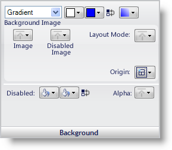
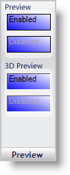
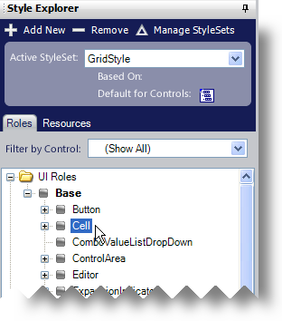
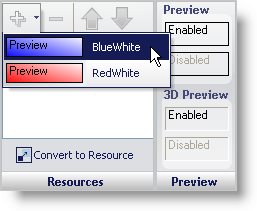
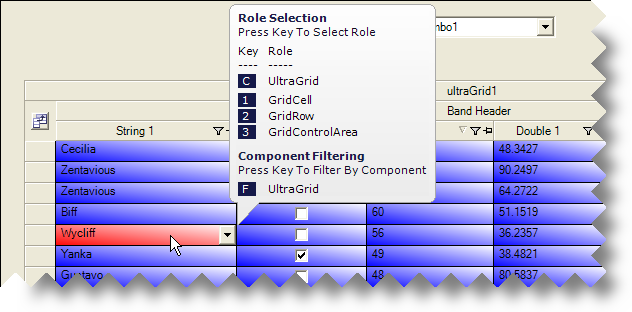

////

|metadata|
{
    "name": "styling-guide-applying-a-resource-to-a-state",
    "controlName": [],
    "tags": ["Styling","Theming"],
    "guid": "{3F0A19FD-AE29-4063-8455-D99A5F00BEC6}",  
    "buildFlags": [],
    "createdOn": "0001-01-01T00:00:00Z"
}
|metadata|
////

= Applying a Resource to a State

You can quickly style different states by creating a Resource with the Style you want to apply.

=== To create a resource:

[start=1]
. Click the Resources tab in the Style Explorer
[start=2]
. Click Add New. A new Resource is added.
[start=3]
. Change the name of the Resource to BlueWhite.
[start=4]
. Change the background style to Gradient. Change the first color to White and the second color to Blue. Change the Gradient style to BackwardDiagonal.

The Preview panel is an important tool when creating resources. It is the only way to preview what the style will look like since the Resource is not attached to a UI Role that you can view in the Canvas area. If the Preview is enabled in the UI Role Editor, it will look like this:

[start=5]
. Create another Resource by following steps 1 through 4 again, but this time, change the name of the Resource to RedWhite, and instead of Blue, change the second color in the gradient to Red. You should now have two Resources: BlueWhite and RedWhite.

=== To apply a resource to a state:

[start=1]
. Click the Roles tab in the Style Explorer.
[start=2]
. Under the UI Roles node, expand Base and then select the Cell UI Role.

.Note
[NOTE]
====
In order to see changes made to the Cell UI Role, make sure the Grid canvas or another canvas that includes the Cell UI Role is displayed.
====

[start=3]
. Add the BlueWhite Resource to the Cell UI Role's Normal state.

[start=4]
. Add the RedWhite Resource to the Cell UI Role's HotTracked state.

If you are viewing the Grid canvas, you will notice that every cell has the Blue/White gradient applied to it. Hover your mouse over any of the cells and whichever cell the mouse pointer is over will appear with the Red/White gradient.

