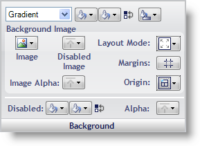

////

|metadata|
{
    "name": "styling-guide-background-pane",
    "controlName": [],
    "tags": ["Styling","Theming"],
    "guid": "{3F236051-1B21-4C66-8C8F-8599DFB465F9}",  
    "buildFlags": [],
    "createdOn": "0001-01-01T00:00:00Z"
}
|metadata|
////

= Background Pane

The Background properties determine what the background of the UI Role state will look like, including background fill, background image, disabled color, and alpha level.

*Background Fill* – You can fill the background of a state with a solid color, gradient, or hatch pattern. When Gradient or Hatch is selected, another Fill box will appear for the second color as well as a button that will let you choose the type of gradient or hatch. You can quickly swap the first and second background colors with the Swap Colors button.

*Background Image* – You can set an image to use for the background of the state by clicking the Image button. When you select File from the drop-down menu, an Open File dialog box appears. You can also set a different image for when the state is disabled. Layout Mode will allow you to center, stretch, or tile the image. When Stretched is selected, the Margins button will appear directly below the Layout Mode button. Clicking the Margins button will allow you to specify what portion of the image you do not want stretched. This is useful for images applied to buttons. The Image Alpha button allows you to choose between UseAlphaLevel, Opaque, and Transparent. Selecting UseAlphaLevel will use the Alpha Level from the Other pane of the UI Role Editor.

*Disabled* – The Disabled button allows you to choose what color the background will be when the state is disabled.

*Alpha* – The Alpha button allows you to choose whether the background will use the Alpha Level from the Other pane, appear Opaque, or appear Transparent.

