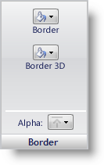

////

|metadata|
{
    "name": "styling-guide-border-pane",
    "controlName": [],
    "tags": ["Styling","Theming"],
    "guid": "{8D787FE6-4A5B-4FB8-AC85-E10556C52069}",  
    "buildFlags": [],
    "createdOn": "0001-01-01T00:00:00Z"
}
|metadata|
////

= Border Pane

The Border properties determine what the border of the UI Role state will look like, including Border, Border 3D, and Alpha.

*Border* – The Border button allows you to choose what color the border of the state will be. The border can also appear transparent by clicking the Transparent button at the top of the color picker.

*Border 3D* – The Border 3D button allows you to choose what color the 3D border of the state will be. The 3D border can also appear transparent by clicking the Transparent button at the top of the color picker.

*Alpha* – The Alpha button allows you to choose whether to use the Alpha Level in the Other pane, or cause the border to appear Opaque or Transparent.

