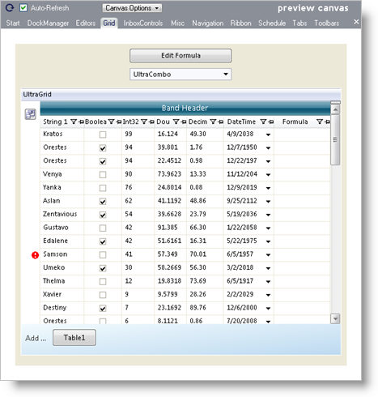
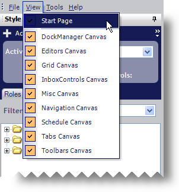
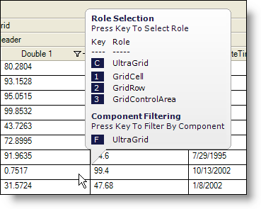
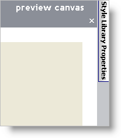
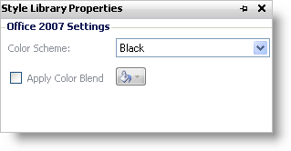

////

|metadata|
{
    "name": "styling-guide-canvas",
    "controlName": [],
    "tags": ["Styling","Theming"],
    "guid": "{594B6953-09EB-419A-8166-17856C4D6420}",  
    "buildFlags": [],
    "createdOn": "0001-01-01T00:00:00Z"
}
|metadata|
////

= Canvas

The canvas is a visual demonstration of how your style would look in a real application. All changes to link:styling-guide-roles.html[UI Role] appearance properties are reflected in the canvas area. The canvas is divided into nine tabbed areas (ten if you count the Start page which is technically not a canvas), each area displaying a control or set of controls.

For example, the Grid canvas shown below displays a large grid with several types of data. The grid itself contains numerous embeddable editors. Above the grid is the WinCombo control which can display a drop-down WinGrid.

Click the following links to find out which controls are contained within each canvas:

* link:styling-guide-dockmanager-canvas.html[DockManager Canvas]
* link:styling-guide-editors-canvas.html[Editors Canvas]
* link:styling-guide-grid-canvas.html[Grid Canvas]
* link:styling-guide-inboxcontrols-canvas.html[InboxControls Canvas]
* link:styling-guide-misc-canvas.html[Misc Canvas]
* link:styling-guide-navigation-canvas.html[Navigation Canvas]
* link:styling-guide-ribbon-canvas.html[Ribbon Canvas]
* link:styling-guide-schedule-canvas.html[Schedule Canvas]
* link:styling-guide-tab-canvas.html[Tab Canvas]
* link:styling-guide-toolbars-canvas.html[Toolbars Canvas]

== Specifying Which Canvases are Shown

You can display any combination of canvases at one time. By default, AppStylist for Windows Forms displays all canvases. If you want to hide a canvas, simply click the 'x' button in the upper-right corner of the canvas. If you would like to show a canvas, click the View menu item.

If a highlighted checkbox does not appear next to the canvas name, that canvas is not being displayed in the workspace. Click the canvas name to add it to the workspace.

== Role Selection ToolTips

As you hover over each item in a canvas, a ToolTip will display for that item. This ToolTip contains valuable UI Role information.

The ToolTip is divided into two columns:

* *Key* -- Press the corresponding key on your keyboard to activate that particular Component Role, UI Role, or to filter by component.
* *Role* -- Always gives the corresponding Component Role first and then lists the UI Roles that this object can play, going from child UI Role to parent UI Role. Also included is an option to filter by component. The component to filter by will always be the corresponding Component Role.

Role Selection ToolTips are an extremely important part of navigation. If you don't know what a particular UI Role is named, but you know what it looks like, the ToolTip can help you figure out the UI Role by hovering over the familiar object.

== Style Library Properties

You'll find the Style Library Properties to the right of the canvas.

Click the Style Library Properties tab and a flyout will display similar to the image below.

You can set the Office 2007 color scheme from here, as well as in the link:styling-guide-infragistics-appstylist-for-windows-forms-options.html[AppStylist for Windows Forms Options dialog box]. There is also a custom blend color that you can apply. This color will blend in with any of the three (blue, black, silver) Office 2007 color schemes, giving your application style a fresh, new look.