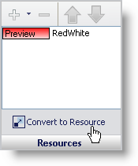
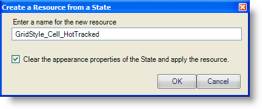
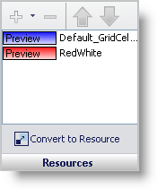

////

|metadata|
{
    "name": "styling-guide-converting-a-state-into-a-resource",
    "controlName": [],
    "tags": ["Styling","Theming"],
    "guid": "{59CC1C9F-AAAB-4526-97DD-39D996641126}",  
    "buildFlags": [],
    "createdOn": "0001-01-01T00:00:00Z"
}
|metadata|
////

= Converting a State into a Resource

When styling a UI Role, you will most likely create a style that you want to apply to other UI Roles. Rather than recreating the style on several different states, you can convert the style into a Resource, which can then be applied to any other state of any UI Role.

=== To convert a state into a Resource:

[start=1]
. Select any state of any UI Role.
[start=2]
. Style the state to suit your application's needs.
[start=3]
. Click Convert to Resource.

A dialog box will display requesting a name for the Resource. The default name given to the Resource will always be  _StyleSet_UIRole_State_ . In this example, the StyleSet is GridStyle, the UI Role is Cell, and the State being styled is HotTracked. You are also given the option to reset the state's appearance properties and apply the Resource instead.

[start=4]
. Once finished renaming the style, click OK. The new Resource is added to the state and the appearance properties are reset.

