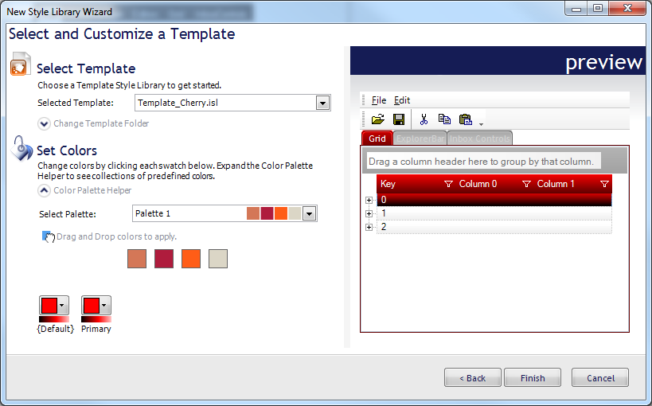
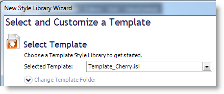
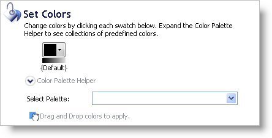

////

|metadata|
{
    "name": "styling-guide-creating-a-style-library-from-a-template",
    "controlName": [],
    "tags": ["Styling","Theming"],
    "guid": "{EA8E02E9-13ED-4FE8-B158-0C0DC277F4FE}",  
    "buildFlags": [],
    "createdOn": "0001-01-01T00:00:00Z"
}
|metadata|
////

= Creating a Style Library from a Template

You can create a Style Library from scratch with vibrant colors and versatility in a matter of minutes with the New Style Library From Template dialog box. All you need to get started is a previously created Infragistics Style Library (.isl) file. Just pick a base color for each ColorCategory in the Style Library and you're done. You'll be producing Style Libraries like a 10-man graphic design team. Follow the simple procedure below for a step-by-step tutorial on creating a new Style Library from a template library.

[start=1]
. On the File menu, click New Style Library... The New Style Library Wizard dialog box appears.
[start=2]
. Select the third option, Create a New Style Library from a Template, and click Next.

[start=3]
. Select a Template from the drop-down list. This drop-down list contains the default templates from AppStylist for Windows Forms' Template folder. You can change this Template folder by clicking Change Template Folder and then clicking the ellipsis (...) to the right of the Template Folder text box.

[start=4]
. Once you have chosen a Template Style Library, a swatch will appear in the Set Colors section for each color category (created in the ColorCategory Manager) contained within the Style Library. Choose a color that best represents your idea of what the Style Library should look like. If you need help choosing colors, the Color Palette Helper can choose matching colors for you.

[start=5]
. Now that you've chosen your template Style Library and colors, click the Go! button to create your new Style Library.