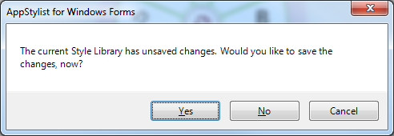
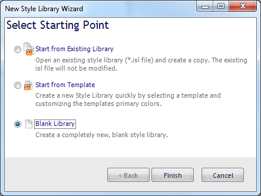
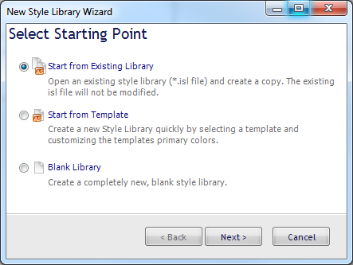
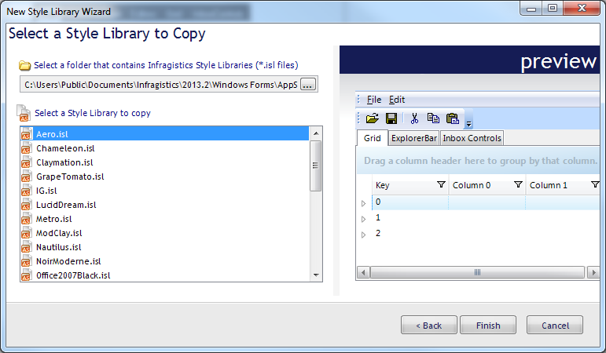

////

|metadata|
{
    "name": "styling-guide-creating-a-style-library",
    "controlName": [],
    "tags": ["Styling","Theming"],
    "guid": "{80E56B64-BF0B-4821-8DA2-6F1D7B878FE2}",  
    "buildFlags": [],
    "createdOn": "0001-01-01T00:00:00Z"
}
|metadata|
////

= Creating a Style Library

If you need to make several Style Libraries for one or more applications, you will need to create a new Style Library. If you have just launched AppStylist for Windows Forms, you will see a Start page. In the Open Recent section of the Start page, you can create a new Style Library by clicking the Create New Library button. If you prefer not to use this method, the New Style Library Wizard can guide you through creating a Style Library. The New Style Library Wizard offers three paths:

* <<blank,Start from Existing Library>>
* <<copy,Start from Template>>
* <<template,Blank Library>>

If there are unsaved changes in the currently loaded Style Library, a dialog box will pop up before the New Style Library Wizard appears asking if you'd like to save them.

* Clicking Yes will open the Save As dialog box if this is a new Style Library that has not been saved before; otherwise, AppStylist saves and closes the current Style Library and creates a new Style Library. For more information on saving Style Libraries, see link:styling-guide-saving-your-work.html[Saving Your Work].
* Clicking No will abandon any unsaved changes to the current Style Library and create a new Style Library.
* Clicking Cancel will stop creating a new Style Library and you can continue working on your current one.

[[blank]]
== Create a New Blank Style Library

[start=1]
. On the File menu, click New Style Library... (you can also bypass the Wizard and create a new blank Style Library by pressing the Ctrl-N key combination). The New Style Library Wizard dialog box appears.

[start=2]
. Select the third option and click Finish.
[start=3]
. A new blank Style Library is created and you can begin link:styling-guide-creating-a-styleset.html[Creating a StyleSet].

[[copy]]
== Create a copy of an existing Style Library

[start=1]
. On the File menu, click New Style Library... The New Style Library Wizard dialog box appears.

[start=2]
. With the first option still selected, click Next.
[start=3]
. Click the ellipsis (...) to browse your file system for the folder that contains your Style Libraries.

 

[start=4]
. If you've chosen a folder that contains Style Libraries, the ISL files will populate the list box below the folder you selected. Choose a Style Library from the list. You will notice that the preview shows you a sample of what the Style Library looks like.
[start=5]
. Click Finish
[start=6]
. AppStylist creates a new Style Library identical to the one you have chosen.

[[template]]
== Create a New Style Library from a Template

[start=1]
. On the File menu, click New Style Library... The New Style Library Wizard dialog box appears.
[start=2]
. Select the second option and click Next.
[start=3]
. You can now use the Infragistics Express Styling interface to create a Style Library based on a template. For more information, see link:styling-guide-creating-a-style-library-from-a-template.html[Creating a Style Library from a Template].