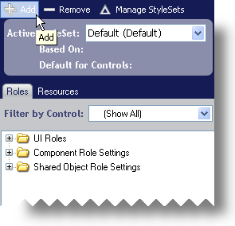

////

|metadata|
{
    "name": "styling-guide-creating-a-styleset",
    "controlName": [],
    "tags": ["Styling","Theming"],
    "guid": "{7836E050-1E36-429F-BDA1-0AA9F30527EB}",  
    "buildFlags": [],
    "createdOn": "0001-01-01T00:00:00Z"
}
|metadata|
////

= Creating a StyleSet

A single Style Library can contain multiple StyleSets that apply to any number of Infragistics controls. You can create a StyleSet for only WinGrid or you can create one that applies to both WinGrid and WinTree. You can also base a StyleSet on a previously created StyleSet. When basing a StyleSet on another one, a control will use the "Based On" Style Set for all its settings unless a setting is specifically overridden in the derived StyleSet. The following procedure will create a simple StyleSet and add it to the Style Library.

*To create a new StyleSet:*

[start=1]
. Click Add New in the toolbar at the top of the Style Explorer.

Depending on your link:styling-guide-infragistics-appstylist-for-windows-forms-options.html[AppStylist for Windows Forms Options], you may be prompted to turn turn off System Themes. If you want to create your own styles, click Yes, Turn Off. If you always want System Themes turned off, select the Remember This Action check box.

[start=2]
. Click Yes, Turn Off. The link:styling-guide-styleset-manager-dialog-box.html[StyleSet Manager Dialog Box] appears.

image::images/AppStyling_Creating_a_StyleSet_03.png[The StyleSet Manager dialog box.]

[start=3]
. Change the StyleSet Name of the StyleSet to something more descriptive such as 'Corporate Blue Style'. If you would like for the StyleSet to apply only to a specific control/component, see link:styling-guide-styling-a-specific-component-type.html[Styling a Specific Component Type] for more information.
[start=4]
. Click OK to add the StyleSet to the Style Library.

The 'Corporate Blue Style' StyleSet now appears in the Active StyleSet drop-down list.

