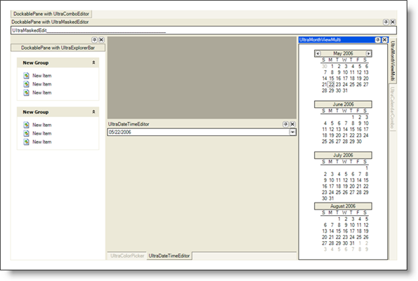
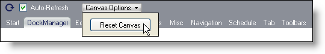

////

|metadata|
{
    "name": "styling-guide-dockmanager-canvas",
    "controlName": [],
    "tags": ["Styling","Theming"],
    "guid": "{8C8C4E8E-4DDF-4FA3-B10F-F4703EDDC195}",  
    "buildFlags": [],
    "createdOn": "0001-01-01T00:00:00Z"
}
|metadata|
////

= DockManager Canvas

View all of your styling modifications that involve the WinDockManager component in the DockManager canvas. The canvas shows the WinDockManager component in several common configurations that you might encounter in your own application. You will find the following controls/components on the DockManager canvas:

* WinCalendarCombo
* WinColorPicker
* WinComboEditor
* WinDateTimeEditor
* WinDockManager
* WinExplorerBar
* WinMaskedEditor
* WinMonthViewMulti

It is possible to modify the DockManager canvas to the point where no windows remain and the canvas is completely empty. If you ever find yourself in a situation where you need the DockManager canvas back to the way you started, click the Canvas Options button at the top of the canvas and then click Reset Canvas.

The DockManager Canvas will now revert back to its original layout.