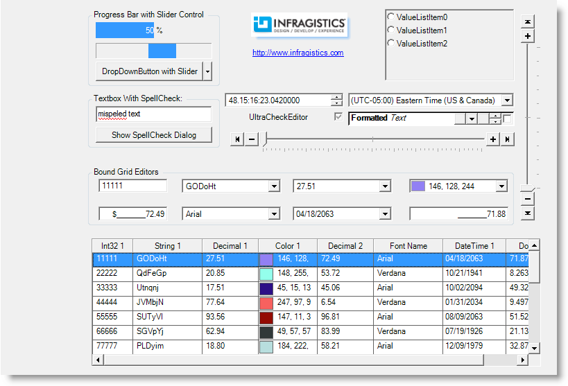

////

|metadata|
{
    "name": "styling-guide-editors-canvas",
    "controlName": [],
    "tags": ["Styling","Theming"],
    "guid": "{3D37F03E-71A5-4CA3-B5D4-0C158C69104F}",  
    "buildFlags": [],
    "createdOn": "0001-01-01T00:00:00Z"
}
|metadata|
////

= Editors Canvas

View all of your styling modifications that involve the WinEditor controls in the Editors canvas. The canvas shows the WinEditor controls in several common configurations that you might encounter in your own application. You will find the following controls/components on the Editors canvas:

* WinButton
* WinCalculatorDropDown
* WinCheckEditor
* WinColorPicker
* WinComboEditor
* WinCurrencyEditor
* WinDateTimeEditor
* WinDropDownButton
* WinFontNameEditor
* WinFormattedLinkLabel
* WinGroupBox

* WinLabel
* WinMaskedEdit
* WinNumericEditor
* WinOptionSet
* WinPictureBox
* WinProgressBar
* WinSpellChecker
* WinTextEditor
* WinTimeZoneEditor
* WinTrackBar

