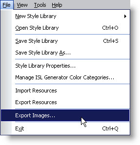
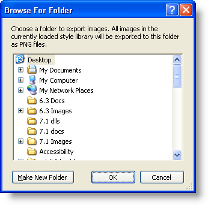

////

|metadata|
{
    "name": "styling-guide-exporting-images-from-a-style-library",
    "controlName": [],
    "tags": ["Styling","Theming"],
    "guid": "{E5DE124B-3DB6-41F0-9908-24C932BBDE8C}",  
    "buildFlags": [],
    "createdOn": "0001-01-01T00:00:00Z"
}
|metadata|
////

= Exporting Images from a Style Library

Infragistics Style Library (.isl) files conveniently store all the information pertaining to each of your StyleSets, including all the images used for the ImageBackground, ImageBackGroundDisabled, and Image properties. All images are embedded in the .isl file to keep Style Libraries together in one small package, rather than having to worry about deploying several small images. This is all well and good until someone, perhaps another graphic designer in your company, needs to use one of the images from the Style Library for a different Style Library. This is where image exporting helps.

You can use the Export Images item on the File menu to export every image in your Style Library to a folder of your choosing. All images will be exported as Portable Network Graphics (.png) files and will have a predetermined file name. The file names will be created as follows:

=== Resources

----
RESOURCE_<resource name>_<image property>
----

=== UI Roles

----
UIROLE_<StyleSet name>_<UI Role>_<State>_<image property>
----

*To export images from a Style Library:*

[start=1]
. On the File menu, click Export Images...

[start=2]
. Navigate to the folder in which you would like to store your images.

[start=3]
. Once you have selected the folder, click OK to export the images. The images are exported and a dialog box appears informing you how many images were exported and to where.

image::Images/AppStyling_Exporting_Images_from_a_Style_Library_03.png[An example of the confirmation dialog that appears when the export is complete.]