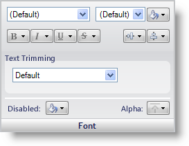

////

|metadata|
{
    "name": "styling-guide-font-pane",
    "controlName": [],
    "tags": ["Styling","Theming"],
    "guid": "{837B392C-B182-4894-9CB8-F190AC794B66}",  
    "buildFlags": [],
    "createdOn": "0001-01-01T00:00:00Z"
}
|metadata|
////

= Font Pane

The Font pane gives you the option of changing the font type, size, color, style, and alignment. Text Trimming is also available as well as the disabled color and alpha level.

*Font Type* – Use the font type drop-down box to select what font this specific state should use.

*Font Size* – Use the font size drop-down box to select how big the font should appear in this state. If you need to select a size not listed in the drop-down box, simply type the number into the font size box.

*Font Color* – The Font Color button allows you to choose what color the font should be for a specific state.

*Font Style* – With these four buttons, you can choose whether the font will be bolded, italicized, underlined, or strikethrough.

*Alignment* – The first button in the group will allow you to select a vertical alignment for text. Text can be vertically aligned to the top, middle, or bottom. The second button in the group will allow you to select a horizontal alignment for text. Text can be horizontally aligned to the left, center, or right.

*Text Trimming* – The Text Trimming drop-down box allows you to specify how to treat text that does not fit in an area.

*Disabled* – The Disabled button allows you to choose what color the font will be when the state is disabled.

*Alpha* – The Alpha button allows you to choose whether the font will use the Alpha Level from the Other pane, appear opaque, or appear transparent.

