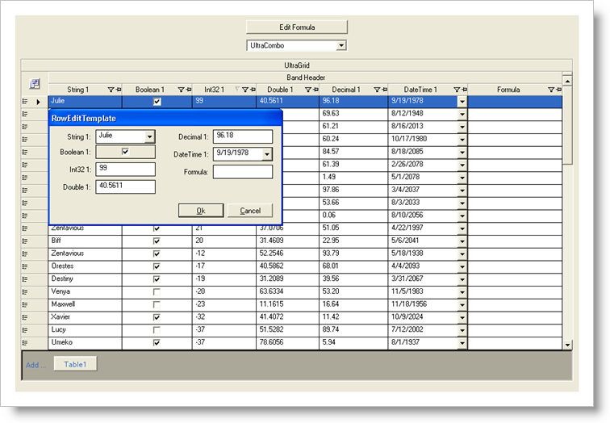

////

|metadata|
{
    "name": "styling-guide-grid-canvas",
    "controlName": [],
    "tags": ["Grids","Styling","Theming"],
    "guid": "{A7D57462-20BF-4657-83C4-DDE3F54716C6}",  
    "buildFlags": [],
    "createdOn": "0001-01-01T00:00:00Z"
}
|metadata|
////

= Grid Canvas

View all of your styling modifications that involve the WinGrid™ control in the Grid canvas. The canvas shows the WinGrid control in several common configurations that you might encounter in your own application. You will find the following controls/components on the Grid canvas:

* WinCombo™
* WinDropDown™
* WinGrid
* WinGridCellProxy™ (In the row edit template)
* WinGridRowEditTemplate™

The Grid Canvas has special canvas options which all affect how the grid is displayed:

[cols="a,a"]
|====
|image::images/AppStyling_Grid_Canvas_02.png[The Grid Canvas's Option dialog with the Appearance tab selected.] 

|*Appearance* 

* *View* -- The end-user can view WinGrid's data several different ways. Depending on the chosen view, the layout of the grid may change drastically (i.e. Card View). 

* *Misc* -- This section contains miscellaneous options that all affect how the grid is displayed. Depending on which View you are using, some of these options may not be available (i.e. Show 'GroupBy' Box is only available in OutlookGroupBy View). Most of these options give you the ability to show or hide visual elements. 

|image::images/AppStyling_Grid_Canvas_03.png[The Grid Canvas's Option dialog with the Functionality tab selected.] 

|*Functionality* 

* *Filtering* -- The end-user, if allowed, can filter the grid to show data in a specific way. Check this box to allow for row filtering. Select the HeaderIcons option to have a filter icon in the row's header. Select FilterRow to display a row that you can filter by. 

* *Summaries* -- The grid can display summaries of the data in each column. Check this box to allow Summaries. You can choose where you want the summaries to show, at the top of the column, at the bottom, or only in GroupBy rows. 

* *New Rows* -- Selecting Allow Add Row will allow the end-user to add new rows to the grid. You can chose if you want to display the AddRow or the AddNew box. 

|====