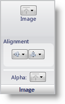

////

|metadata|
{
    "name": "styling-guide-image-pane",
    "controlName": [],
    "tags": ["Styling","Theming"],
    "guid": "{F865CEA6-CF69-4244-A176-213CD845D60C}",  
    "buildFlags": [],
    "createdOn": "0001-01-01T00:00:00Z"
}
|metadata|
////

= Image Pane

The Image pane allows you to set an image in the current state when applicable. Once set, the image can be aligned horizontally or vertically. You can also set the Alpha level of the image.

*Image* -- You can set an image to use for the foreground of the state by clicking the Image button. When you select File from the drop-down menu, an Open file dialog box appears.

*Alignment* – The first button in the group will allow you to select a vertical alignment for the image. Images can be vertically aligned to the top, middle, or bottom. The second button in the group will allow you to select a horizontal alignment for an image. Images can be horizontally aligned to the left, center, or right.

*Alpha* – The Alpha button allows you to choose whether the font will use the Alpha Level from the Other pane, appear opaque, or appear transparent.

