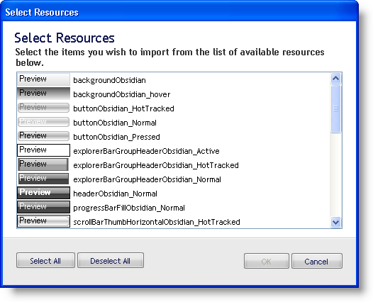
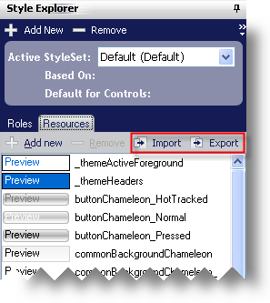
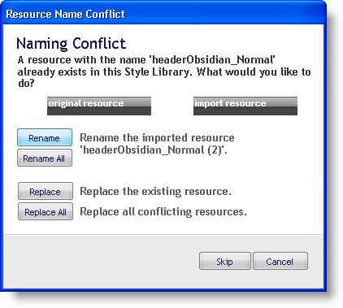

////

|metadata|
{
    "name": "styling-guide-importing-and-exporting-resources",
    "controlName": [],
    "tags": ["Exporting","Styling","Theming"],
    "guid": "{F2A5C483-DA6A-4350-8153-F5D5C11623FA}",  
    "buildFlags": [],
    "createdOn": "0001-01-01T00:00:00Z"
}
|metadata|
////

= Importing and Exporting Resources

AppStylist for Windows Forms can export all resources in your current Style Library as a slimmed-down Infragistics Style Library (.isl) file. An exported resource file is saved in the same format as a basic .isl file, but only resource information is saved. Once exported, you can then import the exported resources into any other Style Library. AppStylist will merge the imported resources with any existing resources.

=== To export resources:

[start=1]
. On the File menu, click Export Resources. A Save As dialog box appears.
[start=2]
. Name your exported resource file.
[start=3]
. Click Save.

=== To import resources:

[start=1]
. On the File menu, click Import Resources. The Open Style Library dialog box appears.
[start=2]
. Navigate to the folder where you exported your resources.
[start=3]
. Select the exported resource file from the dialog box.
[start=4]
. Click Open. The Select Resources dialog box displays.

By default, all Resources are selected. Click the Unselect All button to unselect all Resources. You can select multiple Resources at a time by holding the Ctrl key while clicking Resources.
[start=5]
. Once you have selected the Resources you would like to import, click OK.

You can also import and export resources by using the Import and Export buttons from the Resources tab in the Style Explorer.

=== Resource Name Conflicts

If a Resource you are importing happens to have the same name as a Resource already in your Style Library, the Resource Name Conflict dialog box will prompt you to resolve the name conflict.

There are five options available when dealing with resource name conflicts:

* If you would like AppStylist to rename the imported resource for you, click Rename. AppStylist will always rename the resource by adding a "(2)" at the end of the name.
* If you would like to rename all imported resources with the above mentioned convention, click Rename All.
* You can replace the existing resource with the new one by clicking Replace.
* You can also replace all existing resources with all newer ones by clicking Replace All.
* You also have the option to skip the current resource and move on to the next in the list by clicking Skip.