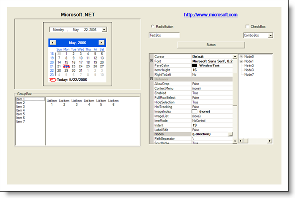

////

|metadata|
{
    "name": "styling-guide-inboxcontrols-canvas",
    "controlName": [],
    "tags": ["Styling","Theming"],
    "guid": "{17D927BF-782A-48F6-83D2-1F185BE0DBA5}",  
    "buildFlags": [],
    "createdOn": "0001-01-01T00:00:00Z"
}
|metadata|
////

= InboxControls Canvas

View all of your styling modifications that involve the Inbox controls in the InboxControl canvas. The canvas shows the Inbox controls in several common configurations that you might encounter in your own application. You will find the following controls on the InboxControls canvas:

* Button
* CheckBox
* ComboBox
* DateTimePicker
* GroupBox
* Label
* LinkLabel
* ListBox

* ListView
* MonthCalendar
* Panel
* PropertyGrid
* RadioButton
* TextBox
* TreeView
* UserControl

