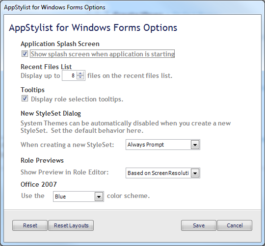

////

|metadata|
{
    "name": "styling-guide-infragistics-appstylist-for-windows-forms-options",
    "controlName": [],
    "tags": ["Styling","Theming"],
    "guid": "{DCCF8C94-E528-4816-9A51-47DE99E36417}",  
    "buildFlags": [],
    "createdOn": "0001-01-01T00:00:00Z"
}
|metadata|
////

= AppStylist for Windows Forms Options

You can customize several key AppStylist for Windows Forms functions by changing options in the AppStylist Options dialog box. Each option is explained in detail below the image.

[start=1]
. *Application Splash Screen* -- When you launch AppStylist, a splash screen appears with valuable application information. This information includes the version of AppStylist that you are currently using and the status of AppStylist. If you clear the check box, AppStylist will no longer show the splash screen during application startup.
[start=2]
. *Recent Files List* -- The Recent Files list is found both in the File menu and in the Open Recent section of the Start page. This list will display all the files that you recently opened in AppStylist. You can display a maximum of 99 recent files.
[start=3]
. *Tooltips* -- When you hover over controls in the different canvases, you will see role selection ToolTips. If you are familiar with the different UI Roles available, you may wish to turn off ToolTips so that the entire canvas is always visible. To turn off ToolTips, clear the check box.
[start=4]
. *New StyleSet Dialog* -- When you create a new StyleSet, you can configure AppStylist to prompt you to turn off System Themes for that StyleSet. If you always want to disable System Themes, then select Turn Themes Off from the drop-down list. If you always want System Themes enabled, select Leave Themes On from the drop-down list. Turning System Themes off is an important step when styling controls and components. If you do not turn System Themes off, you will not see many of your styles.
[start=5]
. *Role Previews* -- If your monitor is set at a lower resolution, you may not have much real estate in the AppStylist user interface. This option allows you to hide the Preview pane in the Role Editor (the Preview pane is always visible in the Resource Editor because there is no Resources pane). You can configure AppStylist to always hide or show the Preview pane. Alternatively, you can set AppStylist to automatically hide or show the Preview pane based on your screen resolution.
[start=6]
. *Office 2007* -- The Office 2007 look and feel is supported in three different color schemes: blue, black, and silver. When you set the ViewStyle property in the Common Component Properties pane of the Properties Panel to Office2007, all components that support this theme will use the color specified in this drop-down box.