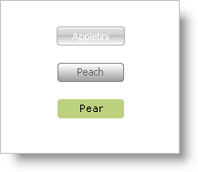

////

|metadata|
{
    "name": "styling-guide-loading-multiple-style-libraries",
    "controlName": [],
    "tags": ["Styling","Theming"],
    "guid": "{91711987-DFAA-4117-918B-2C456BCB6EFE}",  
    "buildFlags": [],
    "createdOn": "0001-01-01T00:00:00Z"
}
|metadata|
////

= Loading Multiple Style Libraries

Applications require more flexibility when it comes to styling. A Style Library contains a Default StyleSet and individual StyleSets for controls. However, there may be a time when you need to use multiple styles for several different controls from different Style Libraries all at the same time.

The Application Styling Framework™ allows you to load as many Style Libraries into memory as you need. You only need to identify each Style Library you load with a unique name. One of the overloads for the StyleManager.Load method accepts three parameters:

* the Style Library's path
* a Boolean identifying whether or not to validate the Style Library when loaded
* and the name that the application will know the Style Library as.

Using this overload will allow you to load multiple Style Libraries and give each of them a name. Controls from your application can then use any one of these Style Libraries by setting their StyleLibraryName property to one of the Style Library names you have chosen.

The following code loads three separate Style Libraries and then sets three previously existing WinButtons to each use one of the different Style Libraries.

*In Visual Basic:*

----
Public Sub New()
	MyBase.New()
	InitializeComponent()
	' Load the three Style Libraries.
	' The first parameter is the path to the Style Library.
	' The second parameter indicates whether to validate or not.
	' The third parameter is the name you give the Style Library.
	StyleManager.Load("C:\\Application Styles\\Peach.isl", _
	  True, "styleLibrary1")
	StyleManager.Load("C:\\Application Styles\\Pear.isl", _
	  True, "styleLibrary2")
	StyleManager.Load("C:\\Application Styles\\Appletini.isl", _
	  True, "styleLibrary3")
End Sub
Private Sub Form1_Load(ByVal sender As System.Object, _
  ByVal e As System.EventArgs) _
  Handles MyBase.Load
	' Setting the StyleLibraryName property will tell
	' the control which Style Library to use. This name
	' corresponds to the third parameter of the Load
	' method above.
	Me.UltraButton1.StyleLibraryName = "styleLibrary1"
	Me.UltraButton2.StyleLibraryName = "styleLibrary2"
	Me.UltraButton3.StyleLibraryName = "styleLibrary3"
End Sub
----

*In C#:*

----
static void Main() 
{
	// Load the three Style Libraries.
	// The first parameter is the path to the Style Library.
	// The second parameter indicates whether to validate or not.
	// The third parameter is the name you give the Style Library.
	StyleManager.Load("C:\\Application Styles\\Peach.isl", 
	  true, "styleLibrary1");
	StyleManager.Load("C:\\Application Styles\\Pear.isl", 
	  true, "styleLibrary2");
	StyleManager.Load("C:\\Application Styles\\Appletini.isl", 
	  true, "styleLibrary3");
	Application.Run(new Form1());
}
private void Form1_Load(object sender, System.EventArgs e)
{
	// Setting the StyleLibraryName property will tell
	// the control which Style Library to use. This name
	// corresponds to the third parameter of the Load
	// method above.
	this.ultraButton1.StyleLibraryName = "styleLibrary1";
	this.ultraButton2.StyleLibraryName = "styleLibrary2";
	this.ultraButton3.StyleLibraryName = "styleLibrary3";
}
----