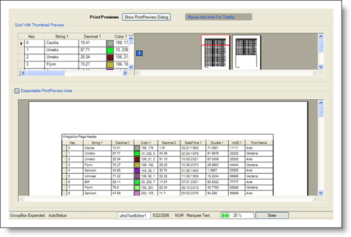

////

|metadata|
{
    "name": "styling-guide-misc-canvas",
    "controlName": [],
    "tags": [],
    "guid": "{C431B29C-8515-49FF-A175-B6A101E13804}",  
    "buildFlags": [],
    "createdOn": "0001-01-01T00:00:00Z"
}
|metadata|
////

= Misc Canvas

View all of your styling modifications that involve the Misc controls in the Misc canvas. The canvas shows the Misc controls in several common configurations that you might encounter in your own application. You will find the following controls on the Misc canvas:

* WinButton
* WinExpandableGroupBox
* WinGrid
* WinLabel
* WinPrintPreviewControl
* WinPrintPreviewThumbnail
* WinStatusBar
* WinTooltip

