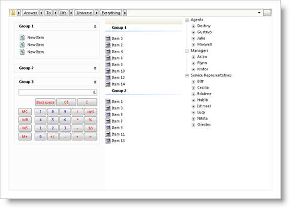

////

|metadata|
{
    "name": "styling-guide-navigation-canvas",
    "controlName": [],
    "tags": ["Styling","Theming"],
    "guid": "{07949128-D532-4A95-8A60-64670336E664}",  
    "buildFlags": [],
    "createdOn": "0001-01-01T00:00:00Z"
}
|metadata|
////

= Navigation Canvas

View all of your styling modifications that involve the navigation controls in the Navigation canvas. The canvas shows the navigation controls in several common configurations that you might encounter in your own application. You will find the following controls on the Navigation canvas:

* WinCalculator
* WinExplorerBar
* WinListView
* WinNavigationBar
* WinTree

You can access several canvas options by clicking the Canvas Options button at the top of the canvas. Selecting any of the options below will change the look of the ExplorerBar, ListView, and Tree respectively.

[cols="a,a"]
|====
|image::images/AppStyling_Navigation_Canvas_02.png[Shows the Canvas Options dialog for the Navigation Canvas with the ExplorerBar tab selected.] 

|image::images/AppStyling_Navigation_Canvas_03.png[Shows the Canvas Options dialog for the Navigation Canvas with the ListView tab selected.] 

|image::images/AppStyling_Navigation_Canvas_04.png[Shows the Canvas Options dialog for the Navigation Canvas with the Tree tab selected.] 

|====