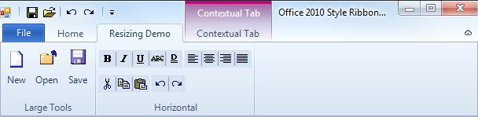

////

|metadata|
{
    "name": "styling-guide-office-2010-look-and-feel",
    "controlName": [],
    "tags": ["Styling","Theming"],
    "guid": "97099817-8dda-4627-9188-2f482502992d",  
    "buildFlags": [],
    "createdOn": "2010-09-22T19:36:02.3984502Z"
}
|metadata|
////

= Office 2010 Look and Feel

In the Infragistics Windows Forms 2010 Volume 3, we added a new look and feel to our controls: the Microsoft® Office 2010 look and feel. This look and feel is unique in the way that it comes in three separate colors: Blue, Black, and Silver. These themes are realized in the Infragistics framework through the static Infragistics.Win.Office2010ColorTable. link:infragistics4.win.v{ProductVersion}~infragistics.win.office2010colortable~colorscheme.html[ColorScheme] property.

All our WinEditor controls support the Office 2010 look and feel through the DisplayStyle property. Several controls that use the button UIElement such as the WinButton, WinScrollBar, and most of our WinEditors support this look and feel through the ButtonStyle property. The controls themselves can take advantage of the Office 2010 look and feel through the ViewStyle property.

Office 2010 Color Table – We have added a new link:infragistics4.win.v{ProductVersion}~infragistics.win.office2010colortable.html[Office2010ColorTable] to manage all the colors used in the Office2010 style. You can switch between color schemes using the ColorScheme property off the Office2010ColorTable object. By default, the color scheme is set to Blue.Though setting these color schemes involves setting one property, every control in your application using the Office 2010 look and feel will take on this color scheme. You cannot have one control using the Blue color scheme while another uses the Black color scheme. The following code will change the Office 2010 color scheme to Black for the entire application:

*In Visual Basic:*

----
Infragistics.Win.Office2010ColorTable.ColorScheme = 
Infragistics.Win.Office2010ColorScheme.Black
----

*In C#:*

----
Infragistics.Win.Office2010ColorTable.ColorScheme =
  Infragistics.Win.Office2010ColorScheme.Black;
----

*Display Style* – The Office 2010 look and feel can be applied to the following controls by setting their DisplayStyle property to Office2010.

* WinCalculatorDropDown™
* WinColorPicker™
* WinCombo™
* WinComboEditor™
* WinCurrencyEditor™
* WinDateTimeEditor™
* WinFontNameEditor™
* WinMaskedEdit™
* WinNumericEditor™
* WinTextEditor™
* WinTimeZoneEditor™
* WinToolTipManager™
* WinTimeSpanEditor™

====== WinFontNameEditor

*View Style* - You can apply the Office 2010 look and feel to the following controls by setting their ViewStyle property to Office2010.

* WinToolbarsManager ( link:infragistics4.win.ultrawintoolbars.v{ProductVersion}~infragistics.win.ultrawintoolbars.ultratoolbarsmanager~style.html[Style])

====== WinToolbarsManager

* WinScrollBar™
* *ScrollBarLook.ViewStyle* – affects the following controls:

** WinExplorerBar™
** WinCombo™
** WinGrid™
** WinListView™
** WinTree™

*Glyph Style* – Our WinCheckEditor and WinOptionSet controls also emulate the Office2010 look and feel.

====== WinCheckEditor

*Button Style* - You can apply the Office 2010 look and feel to the following controls by setting their ButtonStyle property to Office 2010.

* WinCalculatorDropdown™
* WinColorPicker™
* WinCombo™
* WinComboEditor™
* WinCurrencyEditor™
* WinDateTimeEditoR™
* WinFontNameEditor™
* WinMaskedEdit™
* WinNumericEditor™
* WinTimeZoneEditor™
* WinButton™
* WinDropDownButton™
* WinCheckEditor™
* WinScrollBar™

====== WinScrollBar

