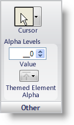

////

|metadata|
{
    "name": "styling-guide-other-pane",
    "controlName": [],
    "tags": ["Styling","Theming"],
    "guid": "{6062B2D7-9724-446A-9DC6-B135B511C3CB}",  
    "buildFlags": [],
    "createdOn": "0001-01-01T00:00:00Z"
}
|metadata|
////

= Other Pane

The Other pane includes options such as the cursor appearance when it hovers over the state, the alpha level of the state, and themed element alpha.

*Cursor* – Select from numerous types of cursors to use as the mouse is hovering over the current state.

*Alpha Level* – The alpha level can be set from 0 to 255. The Background, Border, Font, and Image panes all have an option to use this alpha level. If the alpha level is set to 0, the current state will not appear. As the level increases, the state will become more and more visible until it is fully visible at alpha level 255.

*Themed Element Alpha* – The Themed Element Alpha behaves just like the Alpha buttons on the Background, Border, Font, and Image panes, but only applies to themed elements when the UseOsThemes property is set to True. Setting Themed Element Alpha to Transparent will essentially turn off theming for a particular UI Role.

