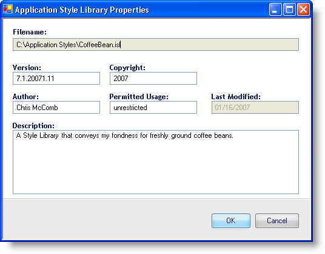

////

|metadata|
{
    "name": "styling-guide-personalizing-your-style-library",
    "controlName": [],
    "tags": ["Styling","Theming"],
    "guid": "{E8B95F24-24C8-4978-ADEE-BB03946B532B}",  
    "buildFlags": [],
    "createdOn": "0001-01-01T00:00:00Z"
}
|metadata|
////

= Personalizing Your Style Library

The Application Style Library Properties dialog box allows you to tag your own Style Libraries with your own personal information. This information can include your name, copyright year, or even an end user license agreement, if you so desire.

To access the Application Style Library Properties dialog box, open the File menu and click Style Library Properties... An image similar to the one below will appear and you can begin personalizing your Style Library.

* *Filename* -- This field identifies the location of the current Style Library. You cannot modify this field.
* *Version* -- Enter the current version of your Style Library. You can leave this field blank.
* *Copyright* -- Enter the copyright year or range of years in this field along with any other copyright text.
* *Author* -- Place your name or your company's name in this field, or any other name identifying who created the Style Library.
* *Permitted* *Usage* -- If this Style Library is free for anyone to modify, put that information in this field.
* *Last* *Modified* -- This field identifies the date this Style Library was last saved. You cannot modify this field.
* *Description* -- Give a description of your Style Library, what colors it uses, if any images are embedded, or any special instructions for someone who might be using or modifying the Style Library.