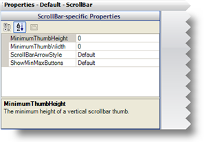

////

|metadata|
{
    "name": "styling-guide-properties-panel",
    "controlName": [],
    "tags": ["Design Environment","Styling","Theming"],
    "guid": "{E6E70EA7-4836-412F-94EB-9DFD8635E67B}",  
    "buildFlags": [],
    "createdOn": "0001-01-01T00:00:00Z"
}
|metadata|
////

= Properties Panel

The Properties Panel is where you modify several types of appearance properties. The Properties Panel is actually a shared container where the Component Role Editor, Shared Object Role Editor, UI Role Editor, and Resource Editor reside. Depending on which role you select in the Role tree, a different editor will display. You will find the Properties Panel at the bottom of the AppStylist for Windows Forms user interface by default, although you have the option of placing it in several other locations in the user interface.

== Component Role Editor

The Component Role Editor displays two Property windows when you select any Component Role in the Role tree of the Style Explorer. These Property windows will display properties that are common between every Component Role, and properties that are specific to that particular Component Role. See the "Component Role Settings" section of the link:styling-guide-roles.html[Roles] topic for more information.

== Shared Object Role Editor

The Shared Object Role Editor will appear visually the same as the Component Role Editor. Both editors use Property windows to set appearance properties. The only difference is that the Shared Object Role Editor has one less property window than the Component Role Editor. See the "Shared Object Role" section of the link:styling-guide-roles.html[Roles] topic for more information.

== UI Role Editor

The UI Role Editor displays appearance properties much differently then the Component Role Editor and Shared Object Role Editor. The UI Role Editor has a more graphical interface than the other two editors and appears only when you select a UI Role from the Role tree in the Style Explorer. The appearance properties in the UI Role Editor are the same for every state of every UI Role that you modify. Every state that you modify has the same set of appearance properties, although they only affect that particular state. See the link:styling-guide-role-editor.html[Role Editor] topic for more information.

== Resource Editor

The Resource Editor is very similar to the Role Editor. The two main differences are that there is no tabbed interface near the top of the Properties Panel and the Resources pane is hidden. You can access the Resource Editor by clicking the Resources tab in the Style Explorer and selecting a Resource. If your current Style Library does not contain any resources, see link:styling-guide-applying-a-resource-to-a-state.html[Applying a Resource to a State] to learn how to create a Resource.

