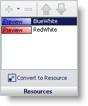

////

|metadata|
{
    "name": "styling-guide-resources-pane",
    "controlName": [],
    "tags": ["Styling","Theming"],
    "guid": "{B187D197-DB13-42F4-8046-CA0EA5AA9839}",  
    "buildFlags": [],
    "createdOn": "0001-01-01T00:00:00Z"
}
|metadata|
////

= Resources Pane

With the Resources pane, you can add resources to states, as well as convert states into resources.

*Plus and Minus buttons* – Click the Plus button to add a resource to a state. Click the Minus button to remove a resource from a state. See link:styling-guide-applying-a-resource-to-a-state.html[Applying a Resource to a State] for more information.

*Up and Down arrows* – If a resource is higher in the list than another resource, its settings will take precedence over a resource lower in the list. For example, the BlueWhite resource has a Blue/White gradient applied to its background. The RedWhite resource has a Red/White gradient applied to its background. The state will have a Blue/White gradient in its background because the BlueWhite resource is higher in the list than the RedWhite resource. However, you can apply a Red/White gradient to the background simply by selecting the RedWhite resource and clicking the Up arrow.

*Convert to Resource* – Clicking Convert to Resource will take the appearance properties of the current state and create a resource from them. See link:styling-guide-converting-a-state-into-a-resource.html[Converting a State into a Resource] for more information.

