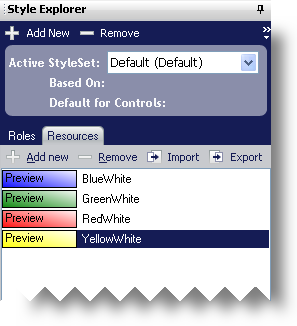

////

|metadata|
{
    "name": "styling-guide-resources",
    "controlName": [],
    "tags": ["Styling","Theming"],
    "guid": "{25808FCE-34DE-480B-877C-6CAFE53E65E8}",  
    "buildFlags": [],
    "createdOn": "0001-01-01T00:00:00Z"
}
|metadata|
////

= Resources

The Resources tab in the Style Explorer allows you to manage all the resources that are currently stored in your Style Library. Resources are helpful containers of style information that you can apply to any state of any UI Role. Through the Resources tab, you can click the following buttons to add and remove resources as well as import and export resources:

* *Add New* –Click this button to create a new resource. You can rename the resource at any time.
* *Remove* – Click this button to permanently delete the resource from the Style Library.
* *Import* – Click this button to launch the Open Style Library dialog box, and select an .isl file to load. For more information on importing resources, see link:styling-guide-importing-and-exporting-resources.html[Importing and Exporting Resources].
* *Export* – Click this button to launch the Save Style Library dialog box, and choose a file name for the exported resource. For more information on exporting resources, see link:styling-guide-importing-and-exporting-resources.html[Importing and Exporting Resources].

Once you have selected a resource to modify, you can change its appearance properties in the Resource Editor at the bottom of the screen. The Resource Editor is similar to the UI Role Editor; the only difference is that the Resources pane has been removed. For more information on resources, see link:styling-guide-using-resources-with-stylesets.html[Using Resources with StyleSets].

