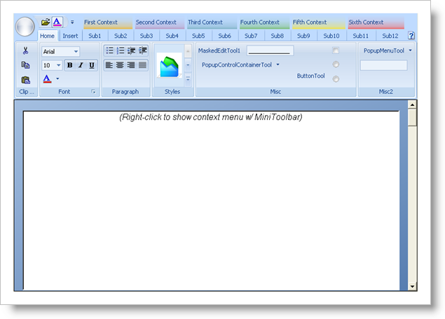

////

|metadata|
{
    "name": "styling-guide-ribbon-canvas",
    "controlName": [],
    "tags": ["Styling","Theming"],
    "guid": "{0F775164-4820-4D85-9B15-70A93ABF5147}",  
    "buildFlags": [],
    "createdOn": "0001-01-01T00:00:00Z"
}
|metadata|
////

= Ribbon Canvas

View all of your styling modifications that involve the Ribbon in the Ribbon canvas. The canvas shows the Ribbon in several common configurations that you might encounter in your own application. You will find the following controls on the Ribbon canvas:

* WinToolbarsManager (contains the Ribbon and MiniToolbar)
* WinFormattedTextEditor
* WinToolTipManager

