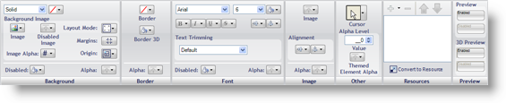

////

|metadata|
{
    "name": "styling-guide-roles",
    "controlName": [],
    "tags": ["Styling","Theming"],
    "guid": "{A1944766-A4BB-45EF-A95B-A436C619CFE5}",  
    "buildFlags": [],
    "createdOn": "0001-01-01T00:00:00Z"
}
|metadata|
////

= Roles

The Role tree helps you to navigate the different types of roles that Application Styling offers. These roles play a pivotal part in styling your applications as every one of them contains some sort of appearance change that can affect the look of your application.

== UI Roles

UI Roles are named for the role that they play in the user interface. A UI Role might include a button, label, or any other graphical element the user can see in an application. These UI Roles are uniquely categorized by inheritance. When you first expand the UI Role node, you will see the Base UI Role. If you make an appearance change to the Base UI Role, every UI Role will inherit those changes as every UI Role is a child of Base. However, once you expand Base and modify the Button UI Role, those modifications will then override Base. Only the properties that were modified will be overridden. All unmodified properties will still be inherited from Base.

When you click on a UI Role, the Properties Panel below the Style Explorer will populate with a tabbed interface displaying all available states for that particular UI Role.

Click the Properties tab to set the Border and Button Styles of certain UI Roles. The Common, Other, and Grid States will allow you to select individual states of the UI Role. Once a state is selected, you will then be able to edit the appearance of the UI Role in the link:styling-guide-role-editor.html[Role Editor].

When a state is modified, the name of the state on the tab, as well as the name of the UI Role in the Role tree, will be bolded, signifying that default options have been changed.

== Component Role Settings

AppStylist for Windows Forms not only gives you the ability to style Infragistics controls and components, but you can also style the in-box components. For more information on in-box control styling, see the "About the InboxControlStyler Component" topic in the "Developer's Guide" section of the Infragistics Windows Forms help. Each component, whether it is in-box or Infragistics, has a group of properties that are similar to other components; and a group of properties that are specific to that individual component. It is important to realize when setting either Common Component Properties or Component-Specific Properties, that you only affect the current component with the changes you make.

=== Common Component Properties

The Common Component Properties window includes properties such as UseOsThemes and UseFlatMode. If you are unaware of these properties, you may have trouble styling your application. For instance, UseOsThemes is a property that, when set to True, will override several appearance properties that you can modify in the UI Role Editor. Each component has these property settings and setting them will only affect the current component.

Another property that is unique to the Common Component Properties window is ResolutionOrder. ResolutionOrder allows you to define the order in which Application Styling and control properties will be resolved. For example, setting ResolutionOrder to ApplicationThenControl will render the control with property settings that the developer makes in Microsoft® Visual Studio®, and then with property settings set in AppStylist. The property settings made in AppStylist will override any settings made in Visual Studio. Setting ResolutionOrder to ControlThenApplication would do the exact opposite and override any AppStylist property settings with the settings the developer makes in Visual Studio. You can also set ResolutionOrder to ControlOnly, and essentially turn off Application Styling completely.

=== Component-Specific Properties

The component-specific properties are properties that are only found in this property window for that specific component. Some components may have the same property in this property window, but the property still only affects that particular component.

== Shared Object Role Settings

The Shared Object Role Settings node contains several objects that are shared between numerous components. A good example of shared objects are the embeddable editors. Several of our editors derive from base classes such as EditorWithCombo, EditorWithMask, and EditorWithText. These shared objects will be applied to any control/component that uses these base classes. Even though a shared object can be used to create a single component, the base object can still be used as a part of another component. The difference between Component Role Settings and Shared Object Role Settings is that when setting a Component Role, you affect only that component. When you set a Shared Object Role, you affect any control/component that uses that Shared Object Role.