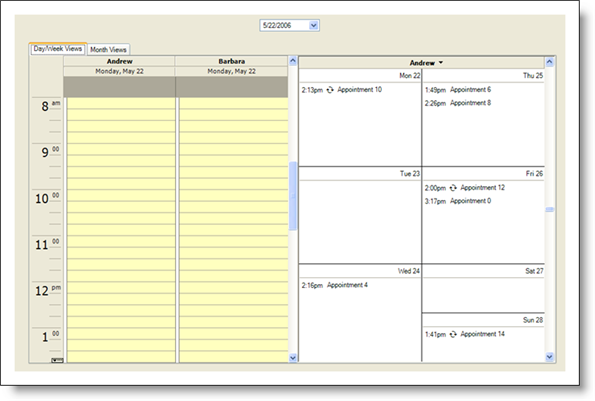

////

|metadata|
{
    "name": "styling-guide-schedule-canvas",
    "controlName": [],
    "tags": ["Scheduling","Styling","Theming"],
    "guid": "{58D7C784-8BBB-4F16-8921-9FDB6598FDF1}",  
    "buildFlags": [],
    "createdOn": "0001-01-01T00:00:00Z"
}
|metadata|
////

= Schedule Canvas

View all of your styling modifications that involve the WinSchedule controls in the Schedule canvas. The canvas shows the WinShedule controls in several common configurations that you might encounter in your own application. You will find the following controls on the Schedule canvas:

* WinCalendarCombo
* WinDayView
* WinMonthViewMulti
* WinMonthViewSingle
* WinWeekView

