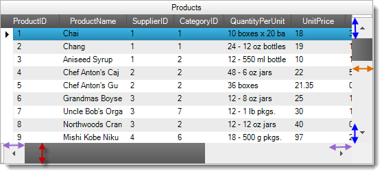

////

|metadata|
{
    "name": "styling-guide-scrollbar-resizing",
    "controlName": [],
    "tags": [],
    "guid": "3ab17f95-570c-48ce-bedd-36f7799cafe9",  
    "buildFlags": [],
    "createdOn": "2012-09-15T18:39:49.7759763Z"
}
|metadata|
////

= Styling Guide Scrollbar Resizing

== Topic Overview

=== Purpose

This topic describes the Scrollbar Resizing feature, lists the applicable Infragistics controls, and provides code examples demonstrating the new feature’s properties.

== Introduction

=== Scrollbar Resizing summary

The Scrollbar Resizing feature allows  _Infragistics_   controls to have their scrollbars and scrollbar arrows resized for ease of use with touch screens and for aesthetic appeal. The designer or developer can specify a custom width for the vertical scrollbar and horizontal scrollbar arrow, and a custom height for the horizontal scrollbar and vertical scrollbar arrow.

The picture below illustrates the Scrollbar Resizing feature as applied to an Infragistics WinGrid control. Notice the enlargement of scrollbars and scrollbar arrows from their default sizes. The blue arrows show the expansion of the vertical scroll arrows’ height. The orange arrow shows the expansion of the vertical scrollbar’s width. The lavender arrows show the expansion of the horizontal scroll arrows’ width. The red arrow shows the expansion of the horizontal scrollbar’s height.

== Resizing Scrollbars on the Application Level

=== Overview

Changing the Shared Object Role Settings for the Scrollbar object in the Application Styling Framework allows you to resize all the Scrollbars and their attendant arrows uniformly across all  _Infragistics_   controls in an application. For more information on the Application Styling Framework and Shared Object Role Settings, refer to the <<_RelatedContent,Related Content>> section at the end of this topic.

=== Property settings

The following table maps the desired scrollbar and scrollbar arrow sizes to their corresponding property settings.

[options="header", cols="a,a,a"]
|====
|In order to:|Use this property:|And set it to: (pixels)

|Use the system default width of the vertical scrollbar.
|VerticalScrollBarWidth
|0 (Default value)

|Set the width of the vertical scrollbar in pixels. For example, if you want a vertical width of 45 pixels, set the property to 45.
|VerticalScrollBarWidth
|45

|Use the system default height of the horizontal scrollbar.
|HorizontalScrollBarHeight
|0 (Default value)

|Set the height of the vertical scrollbar in pixels. For example, if you want a vertical height of 45 pixels, set the property to 45.
|HorizontalScrollBarHeight
|45

|Use the system default width of the horizontal scrollbar arrows.
|HorizontalScrollBarArrowWidth
|0 (Default value)

|Set the width of the horizontal scrollbar arrows in pixels. For example, if you want a horizontal scrollbar arrow of 25 pixels, set the property to 25.
|HorizontalScrollBarArrowWidth
|25

|Use the system default height of the vertical scrollbar arrows.
|VerticalScrollBarArrowHeight
|0 (Default value)

|Set the height of the vertical scrollbar in pixels. For example, if you want a vertical scrollbar arrow of 25 pixels, set the property to 25.
|VerticalScrollBarArrowHeight
|25

|====

=== Illustrations

The following screenshots show the AppStylist for Windows Forms interface configured with the properties settings specified in the above table:

[cols="a,a"]
|====
|image::images/Scrollbar_Resizing_2.png[]|image::images/Scrollbar_Resizing_3.png[]

|====

== Resizing Scrollbars on the Individual Control Level

=== Overview

Directly setting properties in the control’s ScrollBarLook object allows you to resize Scrollbars and their attendant arrows in individual  _Infragistics_   controls.

The ScrollBarLook object is located in the control’s API either directly under the control level, or as a sub-property of another object such as the DisplayLayout or CalendarLook object. The following table provides a quick look up for the location of the ScrollBarLook object.

[options="header", cols="a,a"]
|====
|Control|Location of the ScrollBarLook object

|WinCombo, WinDropDown, WinGrid, WinGridColumnChooser
|Sub-property of DisplayLayout

|WinCalendarCombo, WinDayView, WinMonthViewMulti, WinMonthViewSingle, WinSchedulePrintDocument, WinTimelineView, WinWeekView
|Sub-property of CalendarLook

|All other _Infragistics_ controls with scrollbars.
|At the control level

|====

=== Property settings

The following table maps the desired scrollbar and scrollbar arrow sizes to property settings.

[options="header", cols="a,a,a"]
|====
|In order to:|Use this property:|And set it to: (pixels)

|Use the system default width of the vertical scrollbar.
|ScrollBarLook.VerticalScrollBarWidth
|0 (Default value)

|Set the width of the vertical scrollbar in pixels. For example, if you want a vertical scrollbar width of 45 pixels, set the property to 45.
|ScrollBarLook.VerticalScrollBarWidth
|45

|Use the system default height of the horizontal scrollbar.
|ScrollBarLook.HorizontalScrollBarHeight
|0 (Default value)

|Set the height of the vertical scrollbar in pixels. For example, if you want a vertical scrollbars height of 45 pixels, set the property to 45.
|ScrollBarLook.HorizontalScrollBarHeight
|45

|Use the system default width of the horizontal scrollbar arrows.
|ScrollBarLook.HorizontalScrollBarArrowWidth
|0 (Default value)

|Set the width of the horizontal scrollbar arrows in pixels. For example, if you want horizontal scrollbar arrows width of 25 pixels, set the property to 25.
|ScrollBarLook.HorizontalScrollBarArrowWidth
|25

|Use the system default height of the vertical scrollbar arrows.
|ScrollBarLook.VerticalScrollBarArrowHeight
|0 (Default value)

|Set the height of the vertical scrollbar arrows in pixels. For example, if you want vertical scrollbar arrows height of 25 pixels, set the property to 25.
|ScrollBarLook.VerticalScrollBarArrowHeight
|25

|====

== Code Example: Setting the WinGrid’s Scrollbar and Scrollbar Arrow Sizes

=== Description

In this example, you will programmatically set the scrollbars and scrollbar arrow height and width dimensions to 30 pixels each.

=== Code

This code will make the scrollbars and scrollbar arrows of the WinGrid named “MyGrid” to be 30 pixels in width and height.

*In C#:*

[source,csharp]
----
this.MyGrid.DisplayLayout.ScrollBarLook.VerticalScrollBarWidth = 30;
 this.MyGrid.DisplayLayout.ScrollBarLook.VerticalScrollBarArrowHeight = 30;
this.MyGrid.DisplayLayout.ScrollBarLook.HorizontalScrollBarHeight = 30;
this.MyGrid.DisplayLayout.ScrollBarLook.HorizontalScrollBarArrowWidth = 30;
----

[[_RelatedContent]]
== Related Content

=== Topics

The following topics provide additional information related to this topic.

[options="header", cols="a,a"]
|====
|Topic|Purpose

| link:styling-guide.html[Styling Your Application]
|This topic references topics relating to the framework for styling applications.

| link:styling-guide-roles.html[Roles, Shared Object Role Settings Section]
|This sub-topic within the Application Styling Framework documentation explains style settings that affect multiple controls.

|====