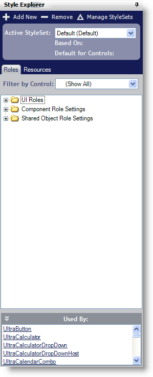

////

|metadata|
{
    "name": "styling-guide-style-explorer",
    "controlName": [],
    "tags": ["Styling","Theming"],
    "guid": "{9DB9303D-0828-4565-9A54-4B6C655EF708}",  
    "buildFlags": [],
    "createdOn": "0001-01-01T00:00:00Z"
}
|metadata|
////

= Style Explorer

The Style Explorer will help you do exactly what its name implies – explore default and custom styles. Through the Style Explorer, you can add, remove, and manage all of your styles – most of these actions requiring just one mouse-click.

Click the Add New button to open the StyleSet Manager (learn more about the StyleSet Manager in link:styling-guide-creating-a-styleset.html[Creating a StyleSet]). The StyleSet Manager opens with a new StyleSet already created. Click the Remove button to instantly remove the selected StyleSet from your current Style Library. Clicking Manage StyleSets will again open the link:styling-guide-styleset-manager-dialog-box.html[StyleSet Manager Dialog Box], this time without creating a new StyleSet.

In the Style Explorer, you can also navigate through roles and manage resources:

* link:styling-guide-roles.html[Roles] – Under the Styles tab, you will find a tree with three main nodes: UI Roles, Component Role Settings, and Shared Object Role Settings. You can filter the tree by component to display only UI Roles, Component Role Settings, and Shared Object Role Settings based on a single component. Underneath the tree is a panel containing useful information about the selected role. This information includes which role is selected and which other components use that role.
* link:styling-guide-resources.html[Resources] – Under the Resources tab, you will find two buttons: Add New and Remove. The Add New button adds a new resource to the Style Library. You can then edit the resources appearance just like you would modify a UI Roles' style. The Remove button will delete the selected resource.

