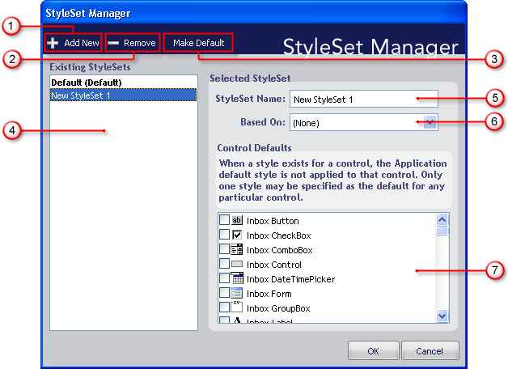

////

|metadata|
{
    "name": "styling-guide-styleset-manager-dialog-box",
    "controlName": [],
    "tags": ["Styling","Theming"],
    "guid": "{A5ACCA34-C5BF-41BE-B377-11565D2072B2}",  
    "buildFlags": [],
    "createdOn": "0001-01-01T00:00:00Z"
}
|metadata|
////

= StyleSet Manager Dialog Box

Manage all of your StyleSets from one convenient location with the StyleSet Manager. The StyleSet Manager can quickly add and remove StyleSets from your current Style Library as well as perform several other tasks. Below is a screenshot of the StyleSet Manager dialog box along with a description of each option.

[start=1]
. *Add New* – Click this button to create a new StyleSet and add it to the current Style Library. Upon clicking the button, a new StyleSet will be created and named "New StyleSet #" (where "#" is automatically incremented for each StyleSet created using the Add New button).
[start=2]
. *Remove* – Click Remove to permanently delete the selected StyleSet from the Style Library. The Delete StyleSet? dialog box will display asking if you are sure you want to delete the chosen StyleSet. Click Yes to remove the StyleSet. Click No to keep the StyleSet.
[start=3]
. *Make Default* – Every component will use the default StyleSet automatically unless the component has its own default. There can be only one default StyleSet for each Style Library. To change the default StyleSet, select the StyleSet you want to set as the default and click Make Default. The new default StyleSet will now display as bold text followed by the word 'Default' in parentheses.
[start=4]
. *Existing StyleSets* – All StyleSets that exist in the current Style Library will be displayed in this list. The default StyleSet is displayed in bold text followed by the word 'Default' in parentheses.
[start=5]
. *StyleSet Name* – This text box displays the name of the selected StyleSet. Use this textbox to edit the name of the StyleSet.
[start=6]
. *Based On* – If you want to base a StyleSet on another one, select the StyleSet you want to base on another StyleSet and then choose the StyleSet you want to base it on from the drop-down list. For example, if you would like to base 'New StyleSet 1' on 'Default', select 'New StyleSet 1' in the Existing StyleSets list and then select 'Default' from the Based On drop-down list. 'New StyleSet 1' will now use all of Default's style information unless it is specifically overridden in 'New StyleSet 1'.
[start=7]
. *Control Defaults* – You can create a StyleSet that is the default for one or more components. If a specific component has a default StyleSet, it will use that StyleSet instead of the Style Library's default StyleSet. A component can have one default StyleSet only. If you try to set a component's default StyleSet when it already has one, a dialog box opens, asking you if you want to change the default StyleSet for that component.