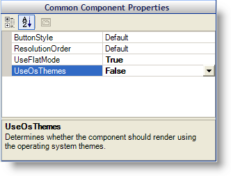
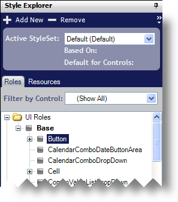
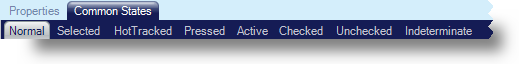
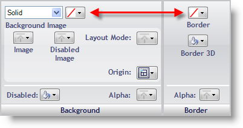
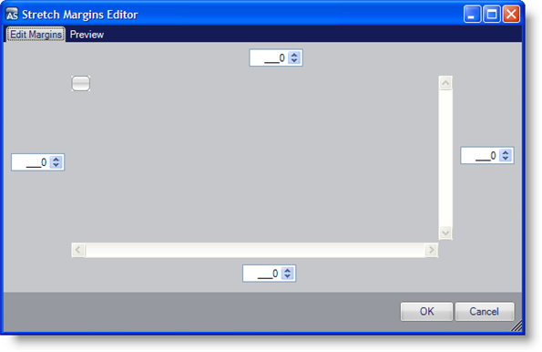
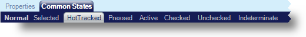
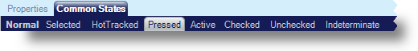

////

|metadata|
{
    "name": "styling-guide-styling-a-button",
    "controlName": [],
    "tags": ["How Do I","Styling","Theming"],
    "guid": "{19337BC6-8A00-4CBB-9AAA-DABE01FE9A75}",  
    "buildFlags": [],
    "createdOn": "0001-01-01T00:00:00Z"
}
|metadata|
////

= Styling a Button

This walkthrough will guide you through the process of creating a Style Library, styling a button, and saving that Style Library. By the end of this step-by-step tutorial you should have a good understanding of AppStylist for Windows Forms and how it functions.

You will need the following images saved to your hard drive in order to take full advantage of this walkthrough. Right-click each image and select Copy from the shortcut menu. Paste the images into your favorite image editing application (Microsoft® Paint will work just fine) and use the suggested filename from the following table:

[options="header", cols="a,a"]
|====
|Image|Save As

|image::images/Button.png[Standard button]
|Button.png

|image::images/Button_HotTracked.png[HotTracked button]
|Button_HotTracked.png

|image::images/Button_Pressed.png[Pressed button]
|Button_Pressed.png

|====

[start=1]
. *Create a new Style Library*

.. From the File menu, click New Style Library. A new Style Library is created.

.Note
[NOTE]
====
If you would like for your new style to be applied only to the WinButton control, you will need to create a new StyleSet targeted at WinButton. See link:styling-guide-styling-a-specific-component-type.html[Styling a Specific Component Type] for more information on targeting specific components. For this walkthrough, however, we will use the Default StyleSet.
====

[start=2]
. *Set Component Role Settings for UltraButton.*

.. Click the Roles tab in the Style Explorer.
.. Expand the Component Role Settings node.
.. Expand the Infragistics Components node.
.. Select UltraButton.
.. Under Common Component Properties, set UseFlatMode to True and UseOsThemes to False.

[start=3]
. *Navigate to the Normal state for the Button UI Role.*

.. In the Style Explorer, expand the UI Roles node.
.. Expand the Base node.
.. Select the Button UI Role.

.. Make sure that the Normal state under the Common States tab is selected in the link:styling-guide-role-editor.html[Role Editor].

[start=4]
. *Style the Button UI Role's Normal state.*

.. Set both the background fill and border color to Transparent.

.. In the Background pane, click Image and select File from the drop-down list.
.. Navigate to where you saved the three button images and open Button.png.

.Note
[NOTE]
====
Depending on which canvas is being displayed, you may see buttons change appearance immediately. An ideal canvas on which to view changes is the link:styling-guide-editors-canvas.html[Editors Canvas]. Switch to the Editors canvas now by clicking the Editors tab at the top of the canvas area. If you need assistance displaying canvases, see the link:styling-guide-canvas.html[Canvas] topic.
====

.. In the Background pane, click Layout Mode and select Stretched from the drop-down list. A Margins button will appear below the Layout Mode button.
.. Click Margins. The Stretch Margins Editor appears.

.. Set the left, top, right, and bottom margins to 5, 4, 5, 4, respectively.

.Note
[NOTE]
====
If you would like to test the margins, click the Preview tab. You will then be able to stretch the image manually with the currently set stretch margins.
====

.. Click OK.

You will notice that several buttons on the canvas don't have the expected appearance. The Show SpellCheck Dialog button looks different from the DropDownButton with Slider button. This is because we set UseFlatMode on the UltraButton component only, but styled the Button UI Role. The Button UI Role affects every button in your application, not just the UltraButton component. Since other components use the Button UI Role, you will need to go back to the Component Role Settings node in the Roles tab of the Style Explorer and select All Components. Now set UseFlatMode to True and UseOsThemes to False. Every button in your application will now look the same.
[start=5]
. *Style the Button UI Role's HotTracked state.*

.. In the Properties Panel, click the HotTracked tab.

.. Perform step 4, but substitute the Button_HotTracked.png image for the Button.png image.

[start=6]
. *Style the Button UI Role's Pressed state.*

.. In the Properties Panel, click the Pressed tab.

.. Perform step 4, but substitute the Button_Pressed.png image for the Button.png image.

[start=7]
. *Save your Style Library.*

.. From the File menu, click Save Style Library… The Save Style Library dialog box appears.
.. Use Button.isl for the file name.
.. Click Save.

Your Style Library is now ready to be used in an application. In order to use the Style Library, you need to add a line of code to the Main method of the application. Refer to "Loading a Style Library" in the "Developer's Guide" section of the Infragistics Windows Forms help for more information on loading Style Libraries.