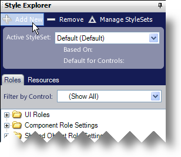
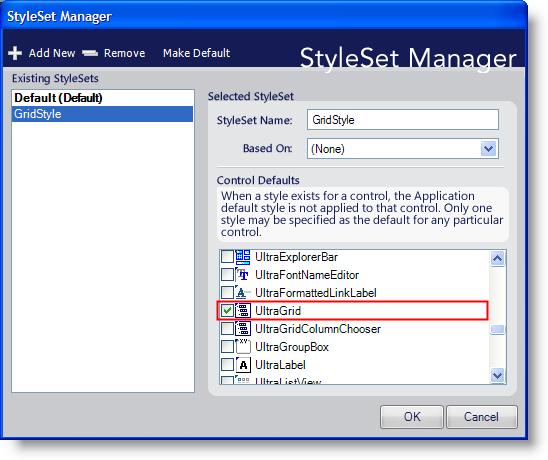
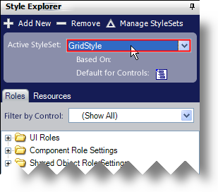
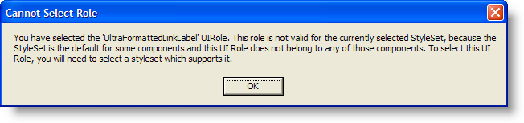

////

|metadata|
{
    "name": "styling-guide-styling-a-specific-component-type",
    "controlName": [],
    "tags": ["How Do I","Styling","Theming"],
    "guid": "{8BA81E2F-3FF0-42ED-99C1-85F0468495C8}",  
    "buildFlags": [],
    "createdOn": "0001-01-01T00:00:00Z"
}
|metadata|
////

= Styling a Specific Component Type

You may wish to apply specific styles to one control/component type such as WinGrid. To do this, you need to create a StyleSet targeted specifically for WinGrid. When the application developer loads a Style Library that contains a StyleSet for a specific component, every control/component will use the default StyleSet while the specific component will use the StyleSet that is targeted for it.

.Note
[NOTE]
====
Every control/component of this specific type will be styled by this targeted StyleSet unless the developer disables Application Styling for a specific instance of that control/component through the UseAppStyling property.
====

This topic will guide you through creating a new StyleSet for the WinGrid control.

[start=1]
. Create a new Style Library by either clicking Create New Library on the Start page or by clicking File, New Style Library. A new Style Library is created.
[start=2]
. In the Style Explorer, click Add New.

The StyleSet Manager appears.
[start=3]
. Give your new StyleSet a name such as GridStyle. Make sure you select the checkbox next to UltraGrid. This will ensure that the StyleSet applies only to the WinGrid control.

[start=4]
. Click OK. The GridStyle StyleSet is now the active StyleSet.

Because GridStyle applies only to WinGrid, the Filter by Control drop-down list will only contain UltraGrid and therefore, only UI Roles applying to WinGrid will show in the Style Explorer. Also, since the Roles are already filtered by UltraGrid, you will not see a filter-by-component option on UI Role ToolTips. If you attempt to select a component from a ToolTip that is not currently accessible, you will receive a dialog box notifying you that you need to use a different StyleSet that supports that specific component.

If you would like to style that particular component, you can simply select the default StyleSet from the Active StyleSet drop-down list. You will then be able to style every component again.