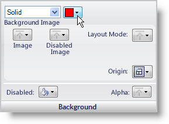
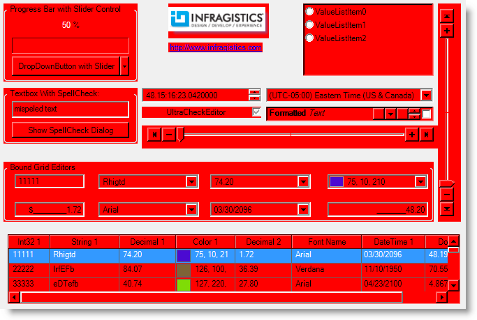
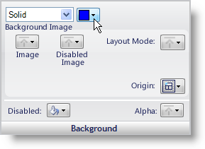
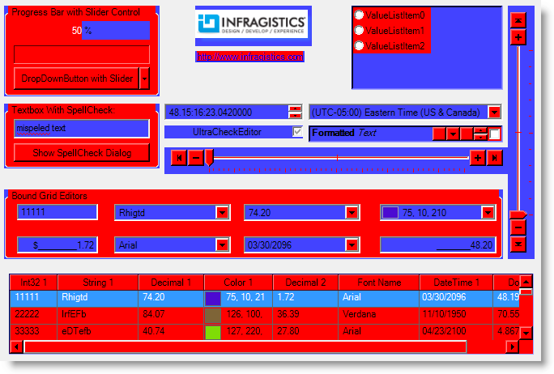
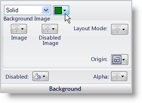
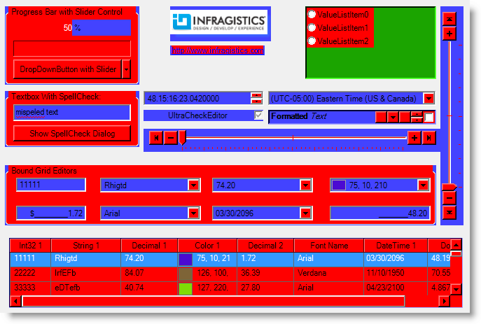

////

|metadata|
{
    "name": "styling-guide-styling-ui-roles-using-inheritance",
    "controlName": [],
    "tags": ["Styling","Theming"],
    "guid": "{5B80B448-7561-4EBA-883C-0EB0AA71DA72}",  
    "buildFlags": [],
    "createdOn": "0001-01-01T00:00:00Z"
}
|metadata|
////

= Styling UI Roles Using Inheritance

AppStylist for Windows Forms is capable of styling several different parts of components that are inherited by each other. At the top level of the UI Role tree is the Base UI Role. Styling this will essentially style every aspect of every stylable component (i.e. every Appearance object of every UI Role). Let's change the Base UI Role's background color to red.

*Styling a UI Role whose appearance is inherited by all components.*

[start=1]
. In a new Style Library, click the Roles tab in the Style Explorer.
[start=2]
. Expand the UI Roles node.
[start=3]
. Click Base.
[start=4]
. Set the background color to Red.

You'll notice as you look at the different canvases that the Background of all stylable UI Roles are now red. The Base UI Role is inherited by all stylable components. In other words, every UI Role inherits from Base.

If you were to change the background color of a UI Role beneath Base, such as ControlArea, you wouldn't see as much red. Let's change the ControlArea UI Role's background color to blue.

*Styling a UI Role whose appearance is inherited by some components.*

[start=1]
. Expand the Base tree node in the Roles tab of the Style Explorer.
[start=2]
. In the list, select ControlArea.
[start=3]
. Set the background color to Blue.

If you take another look at the different canvases, you will notice a red and blue "Superman" look, especially in the Editors canvas. You still have the Base background set to Red, but now the ControlArea UI Role overrides the Base UI Role.

If you drill down in the style inheritance another level, you could style the EditorControl UI Role. Doing this will affect only the ControlAreas in the editor-type controls (e.g. the controls on the Editors canvas). However, instead of styling all the Editor ControlAreas, let's just style the UltraOptionSet's ControlArea.

*Styling a UI Role whose appearance is not inherited by another component.*

[start=1]
. Expand EditorControl under ControlArea in the Roles tab of the Style Explorer.
[start=2]
. Select the UltraOptionSet UI Role.
[start=3]
. Set the Background color to Green.

Look at the different canvases. You will see no green except in the Editors canvas. This is because the UltraOptionSet control is not being used on any canvas with the exception of the Editors canvas. The UltraOptionSet UI Role is the lowest UI Role of the ControlArea inheritance hierarchy. This style change will only be applied to the UltraOptionSet control and will override any style changes that are carried down through the inheritance hierarchy.

