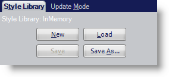
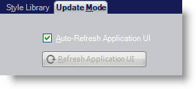
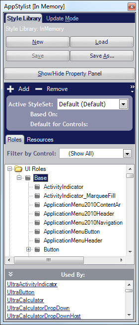

////

|metadata|
{
    "name": "styling-guide-styling-your-application-at-run-time",
    "controlName": [],
    "tags": ["How Do I","Styling","Theming"],
    "guid": "{C644264D-3E86-4211-832B-723D3A1EFAD6}",  
    "buildFlags": [],
    "createdOn": "0001-01-01T00:00:00Z"
}
|metadata|
////

= Styling Your Application at Run Time

The Application Styling Framework™ (ASF) offers you the ability to style your application at run time. Using the ShowRuntimeApplicationStylingEditor method exposed by the AppStylistRuntime class in the AppStylistSupport assembly, you can run a more compact version of AppStylist for Windows Forms that has been designed specifically for styling applications at run time.

Once invoked, the run-time version of AppStylist will display as two separate windows: the link:styling-guide-style-explorer.html[Style Explorer] and link:styling-guide-properties-panel.html[Properties Panel]. The Properties Panel looks and functions exactly as it does in the design-time version of AppStylist.

The Style Explorer in the run-time version of AppStylist is very similar to the design-time version, except that at run-time, the Style Explorer includes a tabbed interface and a Show Property Window button that takes the place of the File menu. This tabbed interface has two tabs: Style Library and Update Mode.

* *Style Library* – This tab contains buttons to open a new Style Library, as well as load and save a Style Library. These buttons function similarly to the File menu items in the design-time version of AppStylist.

* *Update Mode* – Select the check box if you want AppStylist to automatically refresh the application UI whenever you make a change. If you clear this checkbox, you will be able to manually update the UI by clicking the Refresh Application UI button.

