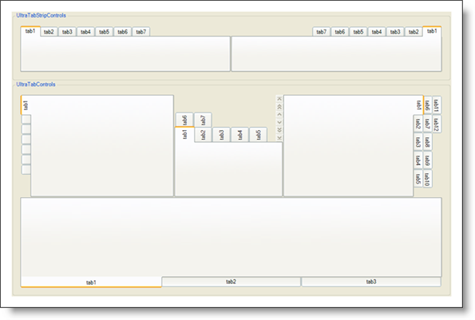

////

|metadata|
{
    "name": "styling-guide-tab-canvas",
    "controlName": [],
    "tags": ["Styling","Theming"],
    "guid": "{097647D1-38D0-48CC-8D5C-6508DAB2BF2A}",  
    "buildFlags": [],
    "createdOn": "0001-01-01T00:00:00Z"
}
|metadata|
////

= Tab Canvas

View all of your styling modifications that involve the WinTab controls in the Tab canvas. The canvas shows the Tab controls in several common configurations that you might encounter in your own application. You will find the following controls on the Tab canvas:

* WinTabStripControl
* WinTabControl

