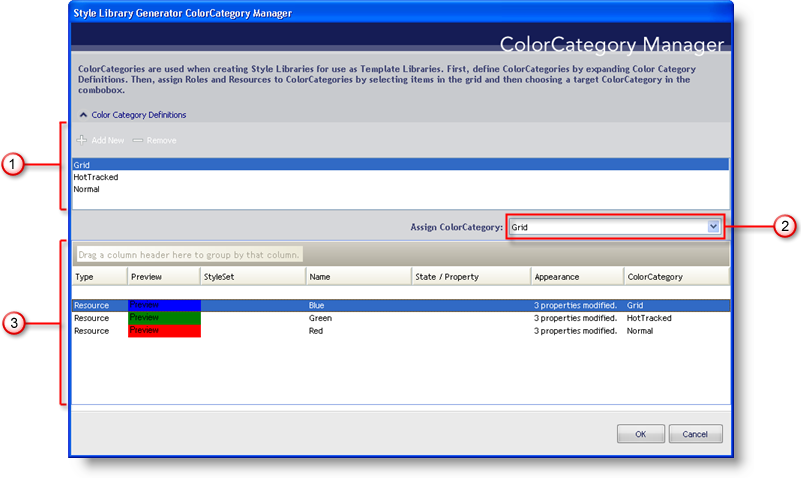

////

|metadata|
{
    "name": "styling-guide-the-style-library-generator-colorcategory-manager-dialog-box",
    "controlName": [],
    "tags": ["Styling","Theming"],
    "guid": "{14F85B39-FF4A-46E6-B255-E31C341170E5}",  
    "buildFlags": [],
    "createdOn": "0001-01-01T00:00:00Z"
}
|metadata|
////

= The Style Library Generator ColorCategory Manager Dialog Box

Before you can create a Style Library based on a template, you will need to create the template itself. A Style Library template is simply a Style Library with color categories attached to Resources and UI Roles. You can create a color category that changes the color for all HotTracked items in a StyleSet, or you can create a color category that manages the base color of each component.

[start=1]
. *Color Category Definitions* -- Manage your color categories in this section. Click Add New to add a new color category. Click Remove to remove the currently selected color category. These color categories are used to create new Style Libraries from templates. In the New Style Library From Template dialog box, you will get a chance to assign colors to the color categories.
[start=2]
. *Assign ColorCategory* -- This drop-down list is always populated with Default, None, and all color categories from the Color Category Definitions section. You can assign a color category to any selected Resource or UI Role in the section below it.
[start=3]
. *Resources and UI Roles* -- All modified Resources and UI Roles in the current Style Library are shown in this section. A great deal of information is displayed here such as whether the item is a Resource or UI Role, what StyleSet the item belongs to, the name of the item, what states and properties it applies to, how many appearance properties have been modified, and finally, the color category assigned to the item. You can easily select one or multiple items by either holding the CTRL key down and selecting items, or using the SHIFT key to select all items between the currently selected item and the item you click next.