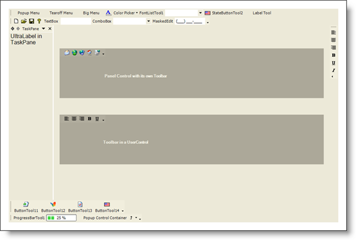

////

|metadata|
{
    "name": "styling-guide-toolbars-canvas",
    "controlName": [],
    "tags": ["Styling","Theming"],
    "guid": "{12B946FF-EEF2-4FC7-AC0C-5DA79EE53B19}",  
    "buildFlags": [],
    "createdOn": "0001-01-01T00:00:00Z"
}
|metadata|
////

= Toolbars Canvas

View all of your styling modifications that involve the WinToolbarManager component in the Toolbar canvas. The canvas shows the WinToolbarManager controls in several common configurations that you might encounter in your own application. You will find the following controls on the Toolbar canvas:

* WinToolbarsManager

