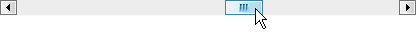

////

|metadata|
{
    "name": "styling-guide-windows-vista-look-and-feel",
    "controlName": [],
    "tags": ["Styling","Theming"],
    "guid": "{3890E6A9-A538-433D-AF30-6240DB577A9E}",  
    "buildFlags": [],
    "createdOn": "0001-01-01T00:00:00Z"
}
|metadata|
////

= Windows Vista Look and Feel

Below is a list of items that we added to the link:win-plf-overview.html[Presentation Layer Framework™ (PLF)] to support the new Vista style for WinToolbarsManager™.

* *Vista Color Table* -- We added a new  pick:[win-forms="link:{ApiPlatform}win{ApiVersion}~infragistics.win.windowsvistacolortable.html[WindowsVistaColorTable]"]  to manage all the colors used in the Vista style. This ColorTable affects WinToolbarsManager menus and toolbars and has two  pick:[win-forms="link:{ApiPlatform}win{ApiVersion}~infragistics.win.windowsvistacolorscheme.html[ColorSchemes]"] : BlueGreen and Blue.
* *New Gradient Styles* -- In 2006 Volume 3, we added new glass-type gradients to the  pick:[win-forms="link:{ApiPlatform}win{ApiVersion}~infragistics.win.gradientstyle.html[GradientStyle]"]  enumeration to support the Office 2007 look and feel. The Vista style has a slightly different gradient for toolbars which prompted us to add four new gradients to the enumeration.

[cols="a,a,a,a"]
|====
|image::images/Win_New_Windows_Vista_Style_for_WinToolbarsManager_Whats_New_20073_01_01.png[new gradient styles for vista style]
|image::images/Win_New_Windows_Vista_Style_for_WinToolbarsManager_Whats_New_20073_01_02.png[new gradient styles for vista style]
|image::images/Win_New_Windows_Vista_Style_for_WinToolbarsManager_Whats_New_20073_01_03.png[new gradient styles for vista style]
|image::images/Win_New_Windows_Vista_Style_for_WinToolbarsManager_Whats_New_20073_01_04.png[new gradient styles for vista style]

|HorizontalWithGlassTop50
|VerticalWithGlassRight50
|HorizontalWithGlassBottom50
|VerticalWithGlassLeft50

|====

* *New Button Styles* -- We added two new button styles to the  pick:[win-forms="link:{ApiPlatform}win{ApiVersion}~infragistics.win.uielementbuttonstyle.html[UIElementButtonStyles]"]  enumeration to support a standard Vista button (WindowsVistaButton) and a Vista button designed specifically for a toolbar (WindowsVistaToolbarButton).

[cols="a,a"]
|====
|image::images/Win_New_Windows_Vista_Style_for_WinToolbarsManager_Whats_New_20073_02_01.png[new button styles for vista style]
|image::images/Win_New_Windows_Vista_Style_for_WinToolbarsManager_Whats_New_20073_02_02.png[new button styles for vista style]

|WindowsVistaButton
|WindowsVistaToolbarButton

|====

* *New Border Style* -- The new WindowsVista border style, located in the  pick:[win-forms="link:{ApiPlatform}win{ApiVersion}~infragistics.win.uielementborderstyle.html[UIElementBorderStyle]"]  enumeration, displays with a four-color border. Depending on the color you chose in the BorderColor property of the associated Appearance object, the top border displays the color specified, while the remaining borders display varying shades of the chosen color. You can view an example of this border style in the new gradient style images above or the editor style below.
* *New Display Style for Embeddable Editors* -- We added a new WindowsVista option to the  pick:[win-forms="link:{ApiPlatform}win{ApiVersion}~infragistics.win.embeddableelementdisplaystyle.html[EmbeddableElementDisplayStyle]"]  enumeration.

* *New Scrollbar Style* -- We added a new WindowsVista option to the  pick:[win-forms="link:{ApiPlatform}win{ApiVersion}~infragistics.win.ultrawinscrollbar.scrollbarviewstyle.html[ScrollBarViewStyle]"]  enumeration to emulate how scrollbars look in Windows Vista.

== Related Topics

link:wintoolbarsmanager-change-the-style-of-wintoolbarsmanager.html[Change the Style of WinToolbarsManager]