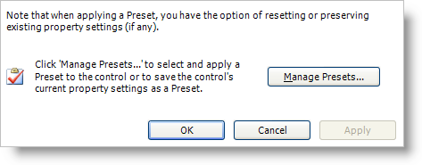
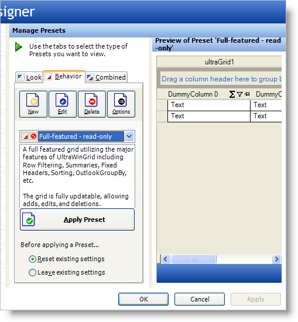

////
|metadata|
{
    "name": "styling-guide-working-with-presets",
    "controlName": [],
    "tags": ["Styling","Theming"],
    "guid": "{E3204B64-1696-4EE4-A0B0-1A9C993DE729}",
    "buildFlags": [],
    "createdOn": "2005-07-06T00:00:00Z"
}
|metadata|
////

= Working with Presets

You can apply a preset to the WinGrid™ control, as well as controls that utilize the WinGrid control. Presets give you a fast, simple way to apply a range of formatting and behavior options across the elements of your interface, and across applications. It is ideal for corporate development environments that need to maintain a consistent look-and-feel among many different developers.

Infragistics Windows Forms provides three different types of presets: Look, Behavior, and Combined presets. As their names indicate, a Look preset contains only information on the visual style of the control, a Behavior preset contains information on how the control will behave, and a Combined preset contains both Look and Behavior information. When a preset is saved, an XML file containing the serialized object style information is created.

For the file location of in-box presets provided by Infragistics for all Infragistics Windows Forms controls/components,  see link:getting-started-where-files-are-placed-on-your-file-system-during-installation.html[Where Files are Placed on your File System During Installation].

== Using the Quick Start to Manage and Apply Presets

Apply a preset to a Infragistics Windows Forms control by opening the control's Designer. This is usually done by selecting the Designer menu option from the control's context menu, or by selecting the Designer action from the Visual Studio Action List. For more information on opening the Designer, see link:win-getting-started.html[Getting Started].

Once the Designer is open, select the Presets node of the navigation tree. The Presets node gives you one basic option: Manage Presets.

=== Choose a Preset

If you want to apply an existing preset to a control, click the Manage Presets button. This will open the Manage Presets area of the Designer which is shown below.

The Manage Presets area lets you view all of the presets available for the control and select the preset you want to apply. By default, the list box displays the in-box presets that are shipped with Infragistics Windows Forms. You can change the location the list box searches for presets by changing the Preset folder under the Options button.

The presets that are available for the control are displayed in a list box. You can display Look, Behavior or Combined presets by selecting the appropriate tab. As you click on different presets in the list box, the Preset Preview pane to the right will display a preview of the control with the selected preset applied.

Once you have found the preset you want to apply to the control, you must click on the Apply Preset button in order for the preset to be applied to the control.

=== Saving a Preset

Another Preset option is to create your own custom Preset. Custom presets can be created in two different ways. First, you can completely customizing the look and behavior of the control and save it as a preset by clicking the New button in the Manage Presets area. Second, you can edit and existing Preset and save the modified preset as your own custom version by clicking the Edit button in the Manage Presets area.

The method of saving the preset is identical regardless of how you create the control. Clicking the New or Edit button opens a dialog that allows you to create or edit a preset.

This dialog box allows you to specify which type of Preset you want to save (Look, Behavior or Both), as well as give your preset a name and Description. Once you have entered these attributes, you can use the property grid to create your custom preset. As you change properties of the control, you can preview them using the control preview in the lower right corner of the dialog box. Once you have completed editing you preset, simply click the Add button to save the preset.